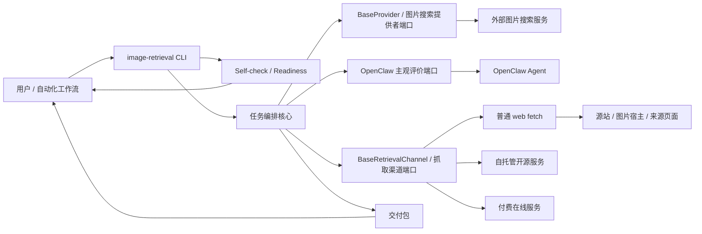
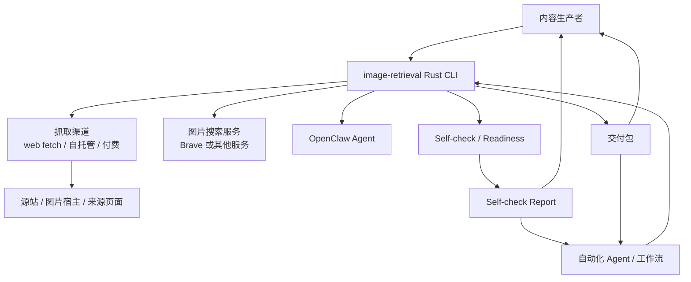
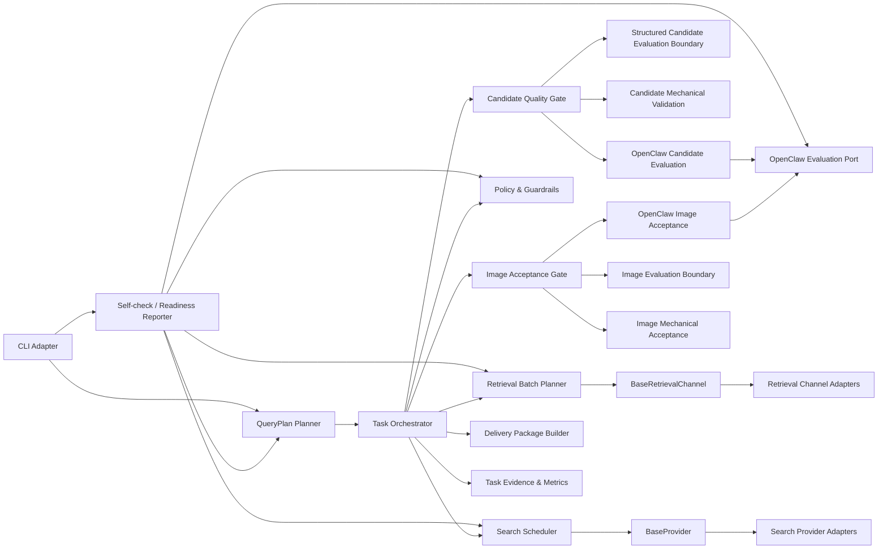
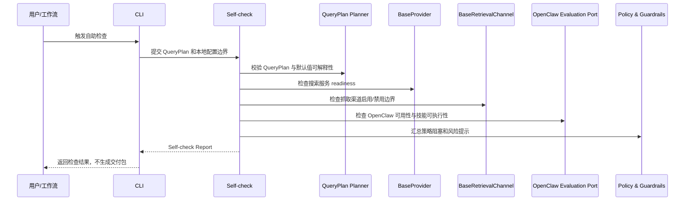
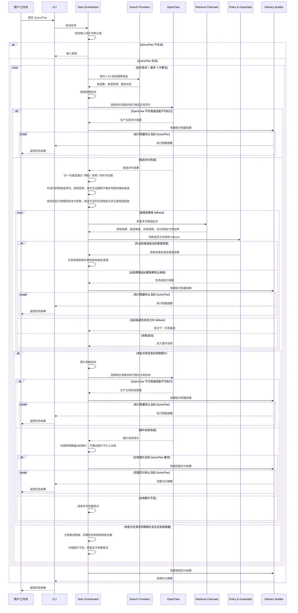
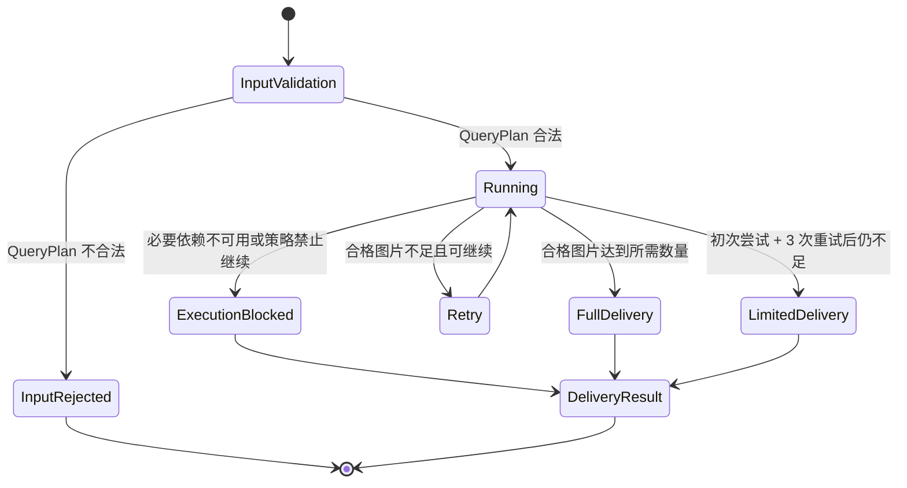
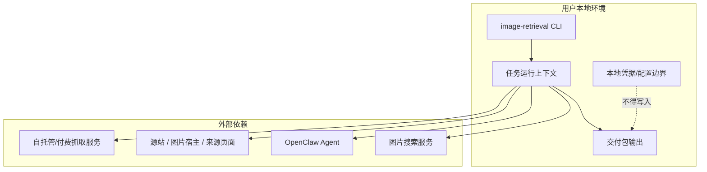

# image-retrieval 高层设计文档（HLD）

## 修订记录
| 版本 | 日期 | 作者 | 修订内容 | 依据/审批 |
| --- | --- | --- | --- | --- |
| v0.11 | 2026-06-19 | Codex | 修复 HLD 运行时正向终止和抓取 fallback 职责边界：明确合格图片达标后立即进入完整交付，并将抓取通道端口职责收敛为能力/限制/失败信息暴露，fallback 决策由编排层和策略边界承担。 | 用户指令；PRD v0.17 [PRD-01]；仓库宪法 [TECH-01] |
| v0.10 | 2026-06-19 | Codex | 收紧为硬 HLD 边界：移除详细设计内容，将主观评价、外部能力端口和交付边界统一上收到架构职责与运行时关系。 | 用户指令；PRD v0.17 [PRD-01]；仓库宪法 [TECH-01] |
| v0.9 | 2026-06-19 | Codex | 收紧 HLD 决策边界：移除未决 provider 清单和 legacy provider 定性，补充目标批次规模与短批次的 ADR，完善无真实抓取图片批次的运行时路径，并让 Task Evidence & Metrics 明确承载 MET-001 至 MET-006。 | 用户指令；PRD v0.17 [PRD-01]；仓库宪法 [TECH-01] |
| v0.8 | 2026-06-19 | Codex | 修复批次语义：将抓取批次从固定规模收敛为目标批次规模，明确可抓取候选不足时允许短批次继续且记录候选短缺，同时保持每个完整尝试只消费一个批次，不足后进入完整流程重试或有限交付。 | 用户指令；PRD v0.17 [PRD-01]；仓库宪法 [TECH-01] |
| v0.7 | 2026-06-19 | Codex | 收敛候选门禁与重试语义：统一使用可抓取候选序列及其优先级，明确不确定导致的降权候选不得进入运行时抓取批次，并限定每个完整尝试只消费一个抓取批次，不足时回到完整流程重试。 | 用户指令；PRD v0.17 [PRD-01]；仓库宪法 [TECH-01] |
| v0.6 | 2026-06-19 | Codex | 将运行前自助检查提升为系统边界和上下文视图能力；补齐普通 web fetch 对外部源站/图片宿主的上下文边界；明确候选评价归一后必须先形成可抓取候选序列，拒绝和待补充证据候选不得进入抓取批次。 | 用户指令；PRD v0.17 [PRD-01]；仓库宪法 [TECH-01] |
| v0.5 | 2026-06-19 | Codex | 补齐运行前自助检查、主观评价不确定结论归一和普通 web fetch 外部源站部署边界，使 FR-012、双阶段评价和抓取合规边界在 HLD 中具备完整架构承载。 | 用户指令；PRD v0.17 [PRD-01]；仓库宪法 [TECH-01] |
| v0.4 | 2026-06-19 | Codex | 收敛 HLD 术语与状态语义：将 BaseProvider 作为搜索 provider 的 HLD canonical 术语并明确其与仓库 BaseSearchProvider 约束的 1:1 关系，分离候选级拒绝与任务级执行阻塞，并让候选/图片主观评价的终止语义可见。 | 用户指令；PRD v0.17 [PRD-01]；仓库宪法 [TECH-01]；`kunora-agent-skills` 参考实现 [REF-IMG-01], [REF-CONTENT-01] |
| v0.3 | 2026-06-19 | Codex | 强调 BaseProvider / BaseRetrievalChannel 的外部能力接入边界，补充结构化搜索结果主观评价与抓取图片主观评价的架构边界，并对齐参考实现中的可用性、来源追踪、真实抓取和包级验收方法。 | 用户指令；PRD v0.17 [PRD-01]；仓库宪法 [TECH-01]；`kunora-agent-skills` 参考实现 [REF-IMG-01], [REF-CONTENT-01] |
| v0.2 | 2026-06-19 | Codex | 修复 HLD 架构契约缺口：补充搜索 provider、抓取 channel、OpenClaw 技能执行和任务状态边界的高层契约，强化 fallback 运行时视图，并限定 TECH-02 为编写时仓库状态。 | 用户指令；PRD v0.17 [PRD-01]；仓库宪法 [TECH-01]；HLD 写作原则 [M-HLD-03], [M-HLD-08] |
| v0.1 | 2026-06-19 | Codex | 初始 HLD，基于 PRD v0.17 和仓库宪法定义 Rust CLI 的高层架构、模块边界、运行流程、质量属性、风险与需求追踪。 | 用户指令；PRD v0.17 [PRD-01]；仓库宪法 [TECH-01]；HLD 写作原则 [M-HLD-01], [M-HLD-03], [M-HLD-08] |

## 文档概述
| 项目 | 内容 |
| --- | --- |
| 文档目的 | 为 `image-retrieval` v0.1 MVP 提供高层架构设计，支撑后续详细设计、开发计划、测试计划和集成决策。本文只定义系统边界、模块职责、关键运行时关系、质量属性、架构决策和风险，不定义数据结构、接口字段、Rust crate 拆分、配置格式、算法阈值、外部服务协议或文件布局。 | [PRD-01], [M-HLD-01] |
| 目标读者 | 产品负责人、工程负责人、Rust 实现者、QA、安全/合规评审者、OpenClaw 集成决策方、外部搜索与抓取服务集成方。 | [PRD-01], [TECH-01] |
| 系统边界 | 本地 Rust CLI：接收 QueryPlan，触发运行前自助检查并返回 Self-check Report，或执行正式任务：搜索候选，校验和评价候选，形成可抓取候选序列，分批抓取图片，验收图片，重试或有限交付，构建交付包。 | [PRD-01], [TECH-01] |
| 当前状态 | 架构设计评审中；截至 HLD v0.11 编写时，仓库尚未包含 Cargo 工程骨架；BaseProvider、BaseRetrievalChannel、运行前自助检查、结构化搜索结果主观评价、候选可抓取性归一、目标批次规模、短批次继续、单批次完整尝试、达标后完整交付终止、无真实抓取图片批次处理与抓取图片主观评价的架构边界已明确，OpenClaw 接入方式、默认真实搜索服务、内置 provider 清单、授权阻塞细则、付费渠道边界和抓取渠道第四级仍待决。 | [PRD-01], [TECH-02] |

本文使用 C4 风格的上下文、容器/模块、运行时和部署视图说明架构边界；使用 ADR 风格记录关键架构决策及权衡。 [M-HLD-03], [M-HLD-08]

## 背景与目标
`image-retrieval` 要解决的是从自然语言图片需求到可解释交付包的本地自动化闭环：用户提交 QueryPlan，系统搜索候选图片，过滤与排序候选，分批抓取图片，完成机械验收和 OpenClaw 主观验收，最后生成完整交付、有限交付、执行阻塞或输入拒绝结果。 [PRD-01]

HLD 的核心目标是把 PRD 的产品流程转化为稳定的架构边界：输入解析、搜索提供者、候选校验、主观评价、抓取渠道、图片验收、重试编排和交付打包必须彼此独立、可替换、可测试，并且不绕过合规约束。 [PRD-01], [TECH-01]

术语约定：本文以 `BaseProvider` 作为搜索 provider 的 HLD canonical 术语，它与仓库宪法中的 `BaseSearchProvider` 是同一搜索服务接入契约的两种命名，不是两个并行接口。`BaseRetrievalChannel` 也是同理，它是抓取通道接入契约的 canonical HLD 术语。 [PRD-01], [TECH-01]

| 架构目标 | 设计响应 | 来源 |
| --- | --- | --- |
| 支持本地 CLI MVP。 | 采用单进程 CLI 编排架构，避免引入 Web UI、SaaS、多用户服务端或任务队列。 | [PRD-01], [TECH-01] |
| 支持运行前自助检查。 | 将自助检查设计为 CLI 可触发的 readiness 边界，用于在正式任务运行前汇总 QueryPlan、搜索服务、抓取渠道、OpenClaw 和策略阻塞问题。 | [PRD-01] |
| 支持外部搜索服务与抓取渠道可插拔。 | 将 `BaseProvider`、`BaseRetrievalChannel` 和 OpenClaw 主观评价设计为外部能力端口，由核心编排层通过稳定边界调用。 | [PRD-01], [TECH-01] |
| 支持主流图片搜索引擎接入。 | `BaseProvider` 只表达搜索能力边界，不绑定单一搜索服务品牌；搜索提供者注册、可用性检查、能力声明和加权调度都在端口外层完成。Brave Image Search 等外部搜索服务可以作为接入对象，但默认真实搜索服务、内置 provider 清单和受限 provider 策略仍需后续决策。 | [PRD-01], [REF-IMG-01] |
| 支持简单/开源/收费抓取通道接入。 | `BaseRetrievalChannel` 只表达取回能力、渠道等级、限制和失败信息边界，不绑定单一路径；本地直抓、开源自托管和付费通道都应走同一高层契约，fallback 决策由编排层和策略边界完成。 | [PRD-01], [REF-CONTENT-01] |
| 结构化搜索结果必须可主观评价。 | 候选阶段的主观评价以结构化候选信息、来源说明和机械校验参考信息为架构输入边界，而不是直接依赖搜索服务原始结果。 | [PRD-01], [REF-IMG-01] |
| 抓取图片必须可主观评价。 | 图片阶段的主观评价以真实抓取图片、机械验收参考信息和来源风险说明为架构输入边界，而不是只依赖候选元信息。 | [PRD-01], [REF-CONTENT-01] |
| 保证产品闭环可解释。 | 任务上下文贯穿候选、抓取、验收、拒绝原因、风险提示和交付摘要。 | [PRD-01] |
| 保证生产主观评价不可跳过。 | OpenClaw 作为生产主观评价依赖；不可用时合法任务进入执行阻塞。 | [PRD-01] |
| 控制合规风险。 | 安全与合规策略作为横切边界，阻止绕过登录、付费墙、访问控制或站点授权限制。 | [PRD-01], [TECH-01] |

## 架构摘要
推荐架构为“本地 CLI 编排核心 + 运行前自助检查 + 可插拔外部能力端口 + 双阶段质量门禁 + 可解释交付包”。CLI 负责接收 QueryPlan，并触发自助检查或正式任务；核心编排层负责搜索、候选筛选、抓取、图片验收、重试和结果状态；外部能力端口负责搜索服务、抓取渠道和 OpenClaw 主观评价；交付包是最终用户和后续自动化工作流消费的结果边界。 [PRD-01], [TECH-01]

在这一架构里，`BaseProvider` 与 `BaseRetrievalChannel` 是两条最重要的外部能力主干：前者承接图片搜索引擎接入，后者承接抓取通道接入。它们都不负责质量结论，只负责把能力、可用性、失败原因和来源信息送进核心编排层。主观评价则分成两次：一次针对结构化搜索结果，一次针对实际抓取图片。 [PRD-01], [REF-IMG-01], [REF-CONTENT-01]

这套架构的主要权衡是把复杂度集中在任务编排和边界契约上，而不是引入服务端平台能力。它适合 MVP 的本地 CLI 范围，并保留后续扩展搜索服务、抓取渠道和自动化消费能力的空间。 [PRD-01], [TECH-01]

## 范围边界
| 类型 | 内容 | HLD 处理方式 | 来源 |
| --- | --- | --- | --- |
| 范围内 | 本地 Rust CLI。 | 设计单机运行、一次 QueryPlan 驱动一次任务的架构；不设计服务端多租户能力。 | [PRD-01], [TECH-01] |
| 范围内 | 运行前自助检查。 | 设计正式任务前的 readiness 边界，用于发现 QueryPlan、搜索服务、抓取渠道、OpenClaw 和策略阻塞问题；不生成交付包。 | [PRD-01] |
| 范围内 | QueryPlan 输入与默认值。 | 设计输入标准化与任务规划模块；具体字段和 CLI 参数形式进入详细设计。 | [PRD-01] |
| 范围内 | 图片搜索服务调度。 | 设计搜索提供者端口、提供者注册与加权随机调度边界；具体 provider 协议进入详细设计。 | [PRD-01], [TECH-01] |
| 范围内 | 候选机械校验与 OpenClaw 主观评价。 | 设计候选质量门禁、结构化候选评价边界和主观评价端口；具体指标实现和 OpenClaw 协议进入详细设计或集成设计。 | [PRD-01], [REF-IMG-01] |
| 范围内 | 分批抓取与 fallback。 | 设计抓取渠道端口、分级 fallback 编排和图片验收边界；第四级渠道作为待确认事项。 | [PRD-01], [REF-CONTENT-01] |
| 范围内 | 图片验收、重试和有限交付。 | 设计验收门禁、任务状态机和重试上限；区分初次尝试和重试次数。 | [PRD-01], [TECH-01] |
| 范围内 | 交付包构建。 | 设计交付包作为用户可读、自动化可判读的结果边界；具体目录和文件格式进入详细设计。 | [PRD-01] |
| 范围外 | Web UI、多用户服务端、任务队列、账号体系、SaaS 化能力。 | 不纳入 HLD 架构元素。 | [PRD-01], [TECH-01] |
| 范围外 | 图片编辑、裁剪、抠图、超分、生成式补图。 | 不设计图片加工模块。 | [PRD-01] |
| 范围外 | 绕过登录墙、付费墙、访问控制或反爬限制。 | 明确作为合规禁止路径。 | [PRD-01] |
| 外部依赖 | OpenClaw Agent。 | 生产主观评价依赖，未决或不可用时进入执行阻塞。 | [PRD-01] |
| 外部依赖 | 图片搜索服务。 | 至少需要一个真实搜索服务完成本地真实服务验证；默认真实搜索服务待决。 | [PRD-01] |
| 外部依赖 | 抓取渠道。 | 普通 web fetch 是基础渠道，自托管和付费渠道按用户启用边界接入。 | [PRD-01] |

## 干系人与关注点
| 干系人 | 关注点 | HLD 响应位置 | 来源 |
| --- | --- | --- | --- |
| 产品负责人 | 产品宪法是否被架构完整承载，开放决策是否可见。 | 背景与目标、架构决策、风险与待确认事项、需求追踪矩阵。 | [PRD-01] |
| 工程负责人 / Rust 实现者 | 模块边界是否清晰，可否渐进实现和测试。 | 架构视图、模块职责、运行时视图、架构决策与权衡。 | [TECH-01], [M-HLD-05] |
| QA | P0/P1 需求如何验证，失败路径是否明确。 | 质量属性目标、运行时视图、可靠性与发布设计、需求追踪矩阵。 | [PRD-01] |
| 安全/合规评审者 | 是否阻止绕过访问控制、错误授权声明和敏感凭据泄露。 | 安全、隐私与合规设计；风险与待确认事项。 | [PRD-01], [TECH-01] |
| OpenClaw 集成决策方 | 主观评价边界、不可用行为和责任边界。 | 架构视图、运行时视图、风险与待确认事项。 | [PRD-01] |
| 外部服务集成方 | 搜索 provider 和 retrieval channel 如何接入且不污染核心流程。 | 架构摘要、容器/模块视图、架构决策与权衡。 | [PRD-01], [TECH-01] |
| 自动化工作流调用方 | 交付结果是否稳定可判读。 | 状态视图、交付包边界、需求追踪矩阵。 | [PRD-01] |

## 质量属性目标
| 质量属性 | 目标 | 度量或验证方式 | 来源 |
| --- | --- | --- | --- |
| 正确性 | 合法 QueryPlan 必须进入完整交付、有限交付或执行阻塞；非法 QueryPlan 必须输入拒绝。 | 覆盖四类任务结果状态的验收用例。 | [PRD-01] |
| 可解释性 | 每张交付图片和主要拒绝类别必须包含用户可理解的来源、质量、风险和原因说明。 | 抽查交付包，确认接受、拒绝、有限交付、执行阻塞都有原因。 | [PRD-01] |
| 可扩展性 | 搜索服务、抓取渠道和主观评价能力可替换或扩展，不改变核心任务流程。 | 新增 provider/channel 时只接入相应端口并通过端口级验收；搜索服务必须满足 `BaseProvider` 高层契约，抓取通道必须满足 `BaseRetrievalChannel` 高层契约。 | [PRD-01], [TECH-01] |
| 可靠性 | 外部服务失败时必须 fallback、有限交付或执行阻塞，不能静默接受不合格图片或无限重试。 | 模拟搜索不足、抓取失败、OpenClaw 不可用和渠道禁用边界。 | [PRD-01] |
| 合规 | 不得绕过登录、付费墙、访问控制或站点授权限制；未知授权不得被描述为可商用或无风险。 | 受限来源和未知授权场景必须产生拒绝、风险提示或执行阻塞。 | [PRD-01] |
| 安全 | 密钥、凭据和敏感配置不得出现在用户交付结果中。 | 检查交付包和用户可见日志不包含敏感凭据。 | [PRD-01] |
| 可观测性 | 任务结果分布、候选满足率、合格图片达成率、主要拒绝原因、渠道有效性和 OpenClaw 评价通过率可被记录。 | 内部 fixture 验证和真实服务验证阶段检查指标可获得。 | [PRD-01] |
| 可维护性 | 核心编排、外部能力端口、校验评价、抓取和交付打包职责分离。 | 模块边界评审和后续详细设计追踪。 | [TECH-01], [M-HLD-02] |

## 约束、假设与依赖
| 类型 | 内容 | 影响 | 来源 |
| --- | --- | --- | --- |
| 约束 | 实现语言为 Rust，产品形态为 CLI。 | HLD 采用本地单进程 CLI 架构，不设计 Web 服务和账号系统。 | [TECH-01], [PRD-01] |
| 约束 | 生产主观评价必须由 OpenClaw 执行，mock 或 fixture 不能作为生产交付依据。 | OpenClaw 不可用时合法任务进入执行阻塞。 | [PRD-01] |
| 约束 | 每个所需交付图片默认约 20 个候选，每批抓取的目标规模为所需交付数量的 2 倍；可抓取候选不足目标规模时允许短批次继续。 | 任务规划模块必须派生候选目标和目标批次规模，编排层必须记录候选短缺并进入后续验收或重试决策。 | [PRD-01] |
| 约束 | 初次尝试后最多重复 3 次，超限后有限交付。 | 任务编排必须区分 `full_attempt_count` 和 `retry_count` 语义。 | [PRD-01], [TECH-01] |
| 约束 | 不能绕过登录、付费墙、访问控制或站点授权限制。 | 抓取 fallback 必须受合规策略约束，不能以升级渠道绕过限制。 | [PRD-01] |
| 假设 | MVP 默认质量档位为通用质量。 | 质量档位策略可先按 PRD 产品口径实现，真实服务验证前仍需校准或放行。 | [PRD-01] |
| 假设 | 交付包既服务人工查看，也为后续自动化消费保留稳定状态。 | 交付包边界必须包含任务结果状态、图片清单、原因和风险说明。 | [PRD-01] |
| 依赖 | OpenClaw 生产评价使用方式和责任边界。 | 未决会阻塞本地真实服务验证和 MVP 发布。 | [PRD-01] |
| 依赖 | 第一版默认真实图片搜索服务。 | 未决会影响真实服务验证范围和用户配置复杂度。 | [PRD-01] |
| 依赖 | 付费抓取渠道启用边界。 | 未决会影响 fallback 范围、成本控制和验证计划。 | [PRD-01] |
| 依赖 | 授权风险阻塞细则和站点规则提示策略。 | 未决会影响合规边界、图片接受率和交付风险说明。 | [PRD-01] |
| 当前状态 | 仓库尚未包含 Cargo 工程骨架。 | HLD 不引用现有代码模块；后续详细设计和开发计划需要先建立工程结构。 | [TECH-02] |

## 架构视图
### 上下文视图
`image-retrieval` 位于用户或上游自动化工作流与外部图片搜索、抓取、OpenClaw 评价能力之间。它不拥有外部图片源，也不提供长期在线服务；它负责在本地任务运行前提供 readiness 自助检查，在正式任务运行中编排外部能力，并生成可解释交付包。普通 web fetch 访问的源站、图片宿主和来源页面属于外部上下文，不属于本地 CLI 拥有或控制的资源。 [PRD-01], [TECH-01]

### 容器/模块视图
HLD 将系统拆为任务编排核心、运行前自助检查、输入规划、搜索、候选质量门禁、抓取、图片验收、交付打包和横切策略模块。模块名代表高层职责，不规定 Rust crate 或具体文件布局。 [PRD-01], [TECH-01], [M-HLD-03]

| 架构元素 | 职责 | 不负责 | 来源 |
| --- | --- | --- | --- |
| CLI Adapter | 接收用户输入，触发任务，向用户返回任务结果位置和关键状态。 | 不承担搜索、抓取、评价和打包业务规则。 | [PRD-01], [TECH-01] |
| Self-check / Readiness Reporter | 在正式任务运行前汇总 QueryPlan 合法性、搜索服务 readiness、抓取渠道启用/禁用边界、OpenClaw 可用性和策略阻塞问题，形成用户可理解的检查结果。 | 不抓取候选、不下载图片、不执行生产主观评价，也不替代正式任务结果。 | [PRD-01], [REF-IMG-01], [REF-CONTENT-01] |
| QueryPlan Planner | 校验 QueryPlan，补齐默认值，派生候选目标、目标批次规模和重试上限。 | 不做外部服务调用。 | [PRD-01] |
| Task Orchestrator | 编排搜索、校验、评价、抓取、验收、重试和交付状态。 | 不内嵌具体 provider/channel 实现。 | [PRD-01], [TECH-01] |
| Search Scheduler | 在多个可用搜索服务之间执行加权随机调度，维护候选来源说明。 | 不决定图片最终是否合格。 | [PRD-01] |
| BaseProvider / Search Provider Port | 定义搜索服务接入边界，屏蔽外部搜索服务差异；所有启用的 image search engine provider 必须满足 `BaseProvider` 高层契约。`BaseProvider` 是仓库宪法中 `BaseSearchProvider` 约束在 HLD 中的 canonical 命名。 | 不保存密钥到交付包；不决定候选是否最终合格。 | [PRD-01], [TECH-01], [REF-IMG-01] |
| Candidate Quality Gate | 汇总候选机械校验和 OpenClaw 候选评价，形成可抓取候选序列及其优先级。 | 不下载最终图片；不把拒绝、待补充证据或不确定导致的降权候选交给抓取规划。 | [PRD-01], [REF-IMG-01] |
| Retrieval Batch Planner | 只从候选质量门禁输出的可抓取候选序列中，为每个完整尝试按所需交付数量的 2 倍作为目标批次规模选择候选；可抓取候选不足时形成短批次继续，并记录候选短缺。 | 不抓取已拒绝、待补充证据、不确定导致的降权或被策略排除的候选；不绕过访问控制或授权限制；不在同一完整尝试内无限补抓。 | [PRD-01], [TECH-01] |
| BaseRetrievalChannel / Retrieval Channel Port | 定义普通 web fetch、自托管服务、付费在线服务的抓取能力边界，并暴露渠道等级、可用性、失败原因、访问控制、授权限制和付费边界信息。 | 不决定跨渠道 fallback 策略；不隐式补全未确认的第四级渠道；不通过 fallback 绕过访问限制。 | [PRD-01], [REF-CONTENT-01] |
| OpenClaw Evaluation Port | 定义候选主观评价和图片主观验收的外部能力边界，暴露可用性、技能可执行性和高层评价结论。 | 不自行生成候选、不抓取图片、不绕过质量门禁的结论归一。 | [PRD-01], [REF-IMG-01], [REF-CONTENT-01] |
| Image Acceptance Gate | 汇总图片机械验收和 OpenClaw 图片主观验收，决定图片是否计入合格交付。 | 不把 mock/fixture 当作生产验收。 | [PRD-01], [REF-CONTENT-01] |
| Delivery Package Builder | 生成完整交付、有限交付或执行阻塞的可解释交付包。 | 不把输入拒绝包装成可消费交付包。 | [PRD-01] |
| Policy & Guardrails | 统一处理授权风险、访问限制、敏感凭据、付费渠道启用边界和产品策略阻塞。 | 不替代用户未决的合规决策。 | [PRD-01] |
| Task Evidence & Metrics | 记录 MET-001 至 MET-006 所需的任务结果分布、候选满足率、合格图片达成率、主要拒绝原因、抓取渠道有效性和 OpenClaw 评价通过率。 | 不定义外部监控平台。 | [PRD-01] |

### 主观评价架构边界
主观评价在 HLD 中不是单一“打分器”，而是两条独立的评价边界：结构化候选评价和实际图片评价。两者都先经过机械门禁，再交给 OpenClaw 执行相关技能，最后由对应质量门禁归一成可执行状态；具体交互方式进入详细设计。 [PRD-01], [REF-IMG-01], [REF-CONTENT-01]

| 评价边界 | 架构输入边界 | OpenClaw 关注点 | 结果作用 | 来源 |
| --- | --- | --- | --- | --- |
| 结构化搜索结果主观评价 | 结构化候选信息、来源说明和机械校验参考信息。 | 候选是否与 QueryPlan 语义、内容约束和质量偏好一致；是否值得进入可抓取候选序列。 | 决定候选是否可抓取，并影响可抓取候选之间的优先级、候选拒绝或降权说明。 | [PRD-01], [REF-IMG-01] |
| 抓取图片主观评价 | 真实抓取图片、机械验收参考信息、来源与风险说明。 | 图片是否真的满足语义、可用性、质量和风险要求。 | 决定图片是否计入合格交付。 | [PRD-01], [REF-CONTENT-01] |

评价边界的统一要求：

- 候选评价只决定候选能否进入可抓取候选序列和候选之间的优先级，不直接决定最终交付。
- 图片评价只决定真实抓取图片能否计入合格交付，不替代候选评价。
- 不确定结论必须由对应质量门禁归一为可执行状态：候选阶段不能被当作明确通过；图片阶段不能计入合格交付。
- 评价无法执行时，合法任务进入执行阻塞，而不是跳过主观评价。
- 评价输出只服务核心编排和交付边界，不直接替代搜索或抓取 provider 的职责。 [PRD-01], [REF-IMG-01], [REF-CONTENT-01]

### 自助检查视图
自助检查是正式任务运行前的 readiness 路径。它复用输入规划、外部能力端口和策略边界来暴露阻塞问题，但不进入搜索、抓取、主观评价或交付打包流程。 [PRD-01]

### 运行时视图
运行时流程必须把“候选阶段”和“图片阶段”分开：候选阶段只决定抓取优先级，图片阶段才决定最终交付合格图片。OpenClaw 相关调用必须表达为“选择相关技能并执行评价请求”的架构边界；抓取失败必须区分可 fallback 失败和访问控制/授权限制失败，fallback 是否继续由编排层结合策略边界决定。 [PRD-01]

关键路径和异常路径如下：合格图片达到 QueryPlan 要求时，系统必须立即构建完整交付并终止当前 QueryPlan；OpenClaw 生产评价、技能选择或技能执行不可用时，合法任务不能降级为 mock 或跳过主观评价，必须执行阻塞并终止当前 QueryPlan；OpenClaw 已执行但返回不确定结论时，不属于执行阻塞，而是由候选或图片质量门禁归一为降权、拒绝、风险说明、继续补充候选或重试等可执行状态；候选短缺本身不构成执行阻塞，除非必要生产依赖不可用或产品策略禁止继续；实际可抓取候选不足目标批次规模时，Retrieval Batch Planner 可以形成短批次继续本次尝试，并将候选短缺写入任务上下文；可抓取候选必须机械未阻塞且主观评价明确认可，拒绝、待补充证据和不确定导致的降权候选不能进入抓取批次；抓取失败可以 fallback，但访问控制、授权限制或付费边界禁止继续时不得通过升级渠道绕过限制。访问控制或授权限制必须先被判定为候选级/渠道级局部拒绝，还是任务级执行阻塞：局部拒绝允许继续其他候选或渠道，任务级执行阻塞会终止当前 QueryPlan。若本批次没有产生真实抓取图片且不存在任务级执行阻塞，系统应记录候选短缺、抓取失败和局部拒绝证据，结束本次完整尝试，并由重试或有限交付规则继续收口。 [PRD-01]

### 状态视图
系统状态分为前置输入拒绝和交付结果状态两类。输入拒绝发生在交付流程之前，不应生成看似可消费的交付包；交付结果状态只包含完整交付、有限交付和执行阻塞，是交付包和自动化消费的核心状态边界。 [PRD-01]

### 部署视图
MVP 部署边界为本地 CLI 进程和本地交付输出。外部搜索服务、OpenClaw、普通 web fetch 访问的源站/图片宿主，以及自托管或付费抓取服务均位于进程外，凭据和敏感配置不得进入用户交付结果。 [PRD-01], [TECH-01]

## 安全、隐私与合规设计
| 控制项 | 高层设计 | 验证方式 | 来源 |
| --- | --- | --- | --- |
| 凭据边界 | 搜索服务、抓取服务和 OpenClaw 凭据属于本地配置/运行边界，不能出现在交付包或用户可见日志中。 | 检查交付包和用户可见日志不包含密钥、token 或敏感配置。 | [PRD-01] |
| 访问控制 | 抓取渠道不得通过 fallback 绕过登录、付费墙、访问控制或站点授权限制。 | 使用受限来源验证时，系统必须拒绝、提示风险或执行阻塞。 | [PRD-01] |
| 授权风险 | 未知授权必须保留风险提示，明确禁止或明显不允许继续使用的来源必须阻塞或拒绝。 | 验收授权未知和明确禁止来源场景。 | [PRD-01] |
| 付费渠道控制 | 付费在线服务默认不启用，必须由用户明确配置或确认。 | 本地真实服务验证前确认付费渠道边界；未启用时验证禁用说明。 | [PRD-01] |
| OpenClaw 生产路径 | 生产主观评价不能由 mock、fixture 或跳过逻辑替代。 | OpenClaw 不可用时合法任务必须执行阻塞。 | [PRD-01] |
| 交付解释 | 质量和风险说明必须基于机械校验参考信息与 OpenClaw 评价结论。 | 抽查交付包中的接受/拒绝原因和风险说明。 | [PRD-01] |

## 可靠性、性能与容量设计
| 主题 | 设计目标 | 高层方案 | 验证方式 | 来源 |
| --- | --- | --- | --- | --- |
| 重试边界 | 初次尝试加最多 3 次重试后仍不足时有限交付。 | Task Orchestrator 维护尝试次数，重试时重复完整流程而不是只重复抓取。 | 构造合格图片不足场景，检查有限交付和缺口说明。 | [PRD-01], [TECH-01] |
| 候选规模 | 每个所需交付图片约 20 个候选。 | QueryPlan Planner 派生搜索目标，Search Scheduler 在服务不足时补充或切换。 | 要求 3 张图片时目标约 60 个候选。 | [PRD-01] |
| 批次规模 | 每批抓取以所需交付数量的 2 倍为目标规模；可抓取候选不足时允许短批次继续。 | Retrieval Batch Planner 在每个完整尝试中只取一个可抓取候选批次；短批次记录候选短缺，批次验收后仍不足时，由 Task Orchestrator 触发完整流程重试，避免在同一尝试内无限补抓或重复同一批候选。 | 要求 4 张图片时目标批次为 8 个候选；若可抓取候选不足 8 个，则以短批次继续、记录候选短缺，并在验收不足时进入下一次完整流程重试；批次不得包含拒绝、待补充证据或不确定导致的降权候选。 | [PRD-01], [TECH-01] |
| 外部服务失败 | 失败必须进入 fallback、有限交付或执行阻塞。 | Provider/channel 错误被归一为可解释失败原因；必要生产依赖不可用时执行阻塞。 | 模拟搜索不足、抓取失败、OpenClaw 不可用。 | [PRD-01] |
| 调度公平性 | 多搜索服务使用趋势应与权重高低一致，单次任务不作为失败判据。 | Search Scheduler 保留候选来源和可观察任务中的服务使用记录。 | 发布验证或运行观察中检查高权重服务不长期低于低权重服务。 | [PRD-01] |
| 运行前检查 | 正式运行前应能发现输入、外部能力和策略阻塞问题。 | Self-check / Readiness Reporter 汇总 QueryPlan、provider/channel readiness、OpenClaw 可用性和策略边界，不产生交付包。 | 自助检查场景返回可理解的阻塞问题和调整方向。 | [PRD-01] |
| 容量控制 | 单个 QueryPlan 最大交付数量尚未决策。 | MVP 可通过自助检查和有限交付说明暴露大数量风险；是否设置上限是 MVP 后开放问题。 | 大数量任务进入用户可理解的风险提示或有限交付说明。 | [PRD-01] |

## 运维、可观测性与发布设计
| 项目 | 设计 | 负责人 | 来源 |
| --- | --- | --- | --- |
| 任务级日志 | 记录任务状态、尝试次数、候选规模、抓取批次、拒绝类别、执行阻塞原因和交付摘要；不得记录敏感凭据。 | 工程负责人 / 安全评审 | [PRD-01] |
| 指标 | 支持任务结果分布、候选满足率、合格图片达成率、主要拒绝原因、抓取渠道有效性和 OpenClaw 评价通过率。 | 工程负责人 / QA | [PRD-01] |
| 内部 fixture 验证 | 使用离线搜索、离线抓取和 mock 主观评价验证产品闭环；fixture 不可作为生产交付依据。 | 工程负责人 / QA | [PRD-01] |
| 本地真实服务验证 | 使用真实搜索服务、OpenClaw 生产评价、普通抓取渠道，并覆盖所有已启用抓取渠道 fallback 表现与未启用渠道禁用边界。 | 产品负责人 / 工程负责人 / 安全评审 | [PRD-01] |
| MVP 发布 | 所有 P0 验收、本地真实服务验证、MVP 前必须决策项关闭后发布本地 CLI。 | 产品负责人 | [PRD-01] |
| 回滚 | 回滚时保留执行阻塞和风险证据，避免用户失去任务解释。 | 工程负责人 / QA | [PRD-01] |

## 架构决策与权衡
| ID | 决策 | 背景 | 替代方案 | 理由 | 后果 | 状态 | 来源 |
| --- | --- | --- | --- | --- | --- | --- | --- |
| ADR-001 | 采用本地 Rust CLI 单进程编排架构。 | PRD 和仓库宪法要求第一版为本地 CLI，不建设 Web UI 或 SaaS。 | 构建服务端 API、任务队列或 Web 应用。 | 直接满足 MVP 范围，降低多用户、部署和运维复杂度。 | 单机任务能力受本地环境和外部服务可用性限制，后续 SaaS 化需重新设计。 | 已接受 | [PRD-01], [TECH-01] |
| ADR-002 | 搜索服务、抓取渠道和 OpenClaw 评价采用端口/适配器边界。 | PRD 要求 provider/channel 可配置、可插拔，OpenClaw 生产评价不可跳过。 | 在编排核心中直接调用具体服务。 | 保持核心流程稳定，降低新增服务对主流程的影响。 | 详细设计需要承接具体端口、错误归一和凭据处理方案。 | 已接受 | [PRD-01], [TECH-01] |
| ADR-003 | 采用候选阶段和图片阶段的双质量门禁。 | PRD 要求候选和图片都必须经过机械判断与 OpenClaw 主观评价。 | 只在抓取后验收，或只依赖搜索服务排序。 | 先筛候选可减少低价值抓取，抓取后验收可防止最终交付不合格图片。 | 增加 OpenClaw 调用依赖和任务耗时，需要处理 OpenClaw 不可用的执行阻塞。 | 已接受 | [PRD-01] |
| ADR-004 | 任务编排负责完整重试循环，而非只重试失败渠道。 | PRD 要求合格不足时重复整个流程，候选不足时回到搜索补充。 | 仅重试抓取失败的候选，或无限补抓。 | 符合宪法闭环，避免反复消耗同一批候选。 | 编排层需要清晰维护尝试次数、候选消耗和有限交付原因。 | 已接受 | [PRD-01], [TECH-01] |
| ADR-005 | 交付包作为最终结果和自动化消费边界。 | PRD 要求交付包包含图片、状态、来源、质量、风险、拒绝类别和缺口原因。 | 只输出图片文件，或只输出运行日志。 | 让人工和自动化流程都能理解完整交付、有限交付和执行阻塞。 | 详细设计需要承接具体交付包格式和机器可读规范。 | 已接受 | [PRD-01] |
| ADR-006 | 合规策略优先于抓取成功率。 | PRD 守护指标禁止绕过登录、付费墙、访问控制或站点授权限制。 | 在抓取失败时无条件升级渠道。 | 保护产品可信度和合规边界。 | 可能降低合格图片达成率，并增加有限交付或执行阻塞。 | 已接受 | [PRD-01] |
| ADR-007 | 第四级抓取渠道不在 HLD 中隐式补全。 | PRD 记录宪法“四级”与已列三类不一致，需要用户决策。 | 架构自行新增第四级，或把某一类拆分为两级。 | 避免架构越过产品决策边界。 | fallback 设计保留扩展点，但第四级验收需待产品决策后更新。 | 已接受 | [PRD-01] |
| ADR-008 | `BaseProvider` 是搜索 provider 基础契约的 HLD canonical 术语。 | 用户要求 HLD 重点强调 `BaseProvider`，仓库宪法仍使用 `BaseSearchProvider` 命名。 | 同时保留两个并行接口名。 | 避免后续设计和实现产生双接口；`BaseProvider` 与宪法中的 `BaseSearchProvider` 一一对应。 | 详细设计必须把二者视为同一契约；如未来扩展为非搜索 provider，需另行决策。 | 已接受 | [TECH-01], [REF-IMG-01] |
| ADR-009 | 候选主观评价与图片主观评价使用不同评价边界。 | 候选阶段面向结构化搜索结果，图片阶段面向真实抓取图片和视觉证据。 | 使用单一评价边界，或直接把外部搜索/抓取结果交给 OpenClaw。 | 避免候选相关性与最终图片验收混淆，保证只有真实抓取图片才能进入最终交付判断。 | 详细设计需要分别承接候选评价和图片评价的具体交互形式，并保持执行阻塞的终止语义。 | 已接受 | [PRD-01], [REF-IMG-01], [REF-CONTENT-01] |
| ADR-010 | 自助检查是正式任务运行前的 readiness 边界。 | PRD 要求用户在正式运行前发现 QueryPlan、搜索服务、抓取渠道或 OpenClaw 配置问题。 | 只在任务失败后通过日志暴露问题，或把自助检查包装成交付包。 | 让 FR-012 具备独立架构入口，并避免自助检查与交付结果状态混淆。 | 详细设计需要承接检查入口和报告形式，但不得把检查结果当作图片交付。 | 已接受 | [PRD-01], [REF-IMG-01], [REF-CONTENT-01] |
| ADR-011 | 主观评价结论必须由质量门禁归一为可执行状态。 | OpenClaw 可能返回通过、拒绝、不确定或不可执行；PRD 要求候选必须机械未阻塞且主观认可后才能进入可抓取候选序列，图片也只有明确通过才能计入合格交付。 | 让调用方直接消费 OpenClaw 原始结论，或把不确定当作通过。 | 保证候选阶段与图片阶段职责清晰，防止非明确认可的候选进入抓取，防止不确定图片进入合格交付。 | 详细设计需要承接各质量档位下的归一规则；不可执行仍按执行阻塞处理。 | 已接受 | [PRD-01], [REF-IMG-01], [REF-CONTENT-01] |
| ADR-012 | 抓取批次使用目标批次规模，并允许候选短缺下的短批次。 | PRD 同时要求每批抓取数量与所需交付数量的 2 倍绑定，并要求全部服务候选不足时本轮可使用已有候选继续，候选短缺本身不得作为执行阻塞。 | 要求必须满批次后才进入抓取；或完全取消 2 倍批次约束。 | 将 2 倍解释为正常目标批次规模，同时把全部服务不足后的短批次作为候选短缺规则下的允许例外，能同时保持批次容量目标、避免无限重复同一批候选，并让重试/有限交付规则完成闭环。 | 详细设计需要承接批次记录、候选短缺证据和完整尝试计数；验收必须覆盖目标批次不足时仍继续并在不足后完整重试的场景。 | 已接受 | [PRD-01], [TECH-01] |

## 风险、技术债与待确认事项
| 类型 | 内容 | 影响 | 缓解方式 | 负责人 | 状态 | 来源 |
| --- | --- | --- | --- | --- | --- | --- |
| 依赖 | OpenClaw 生产评价使用方式和责任边界未决。 | 影响候选主观评价和图片主观验收能否进入生产发布。 | MVP 发布前确认；不可用时执行阻塞。 | 用户 / 产品负责人 | MVP 前必须决策 | [PRD-01] |
| 依赖 | 第一版默认真实图片搜索服务未决。 | 影响真实服务验证范围和用户配置复杂度。 | 真实服务验证前确认至少一个默认真实搜索服务。 | 用户 / 产品负责人 | 真实服务验证前必须决策 | [PRD-01] |
| 依赖 | 内置 provider 清单和受限/legacy provider 策略未决。 | 影响 BaseProvider 的默认适配范围、真实服务验证矩阵和用户配置复杂度。 | 真实服务验证前或后续集成设计中确认；HLD 仅规定可插拔能力边界。 | 用户 / 产品负责人 / 外部服务集成方 | 真实服务验证前必须决策 | [PRD-01], [TECH-01] |
| 风险 | 质量档位尚未经过真实任务校准。 | 档位过高会导致有限交付增多，过低会降低图片可用性。 | 真实服务验证前校准或放行。 | 产品负责人 | 真实服务验证前必须校准或放行 | [PRD-01] |
| 风险 | 授权风险阻塞细则尚未确认。 | 影响合格图片数量和合规姿态。 | MVP 发布前由用户/安全评审确认。 | 用户 / 安全评审 | MVP 前必须决策 | [PRD-01] |
| 风险 | 付费抓取渠道启用边界未决。 | 影响成本控制、真实服务验证范围和 fallback 策略。 | 真实服务验证前确认验证阶段是否允许启用付费渠道。 | 用户 / 产品负责人 | 真实服务验证前必须决策 | [PRD-01] |
| 开放问题 | 是否默认启用站点规则或 robots 风险提示。 | 影响可抓取范围、基础合规策略和真实服务验证入口。 | 真实服务验证前完成产品和安全决策。 | 用户 / 安全评审 | 真实服务验证前必须决策 | [PRD-01] |
| 开放问题 | 抓取渠道第四级是否存在、是否为表述误差，或是否需要拆分现有类别。 | 影响 fallback 验收和后续详细设计输入。 | MVP 发布前确认；HLD 保留扩展点但不隐式补全。 | 用户 / 产品负责人 | MVP 前必须决策 | [PRD-01] |
| 技术债 | 仓库尚未包含 Cargo 工程骨架。 | HLD 无法引用现有 Rust 模块，后续详细设计需要先落工程结构。 | 在详细设计或开发计划中建立最小 Rust CLI 工程与测试框架。 | 工程负责人 | 待处理 | [TECH-02] |
| 开放问题 | 单个 QueryPlan 最大交付数量是否需要限制。 | 影响成本、耗时、候选规模和有限交付概率。 | MVP 可先通过自助检查和有限交付说明暴露大数量风险。 | 用户 / 产品负责人 | MVP 后可延期 | [PRD-01] |
| 开放问题 | 交付结果是否需要按授权风险分组展示。 | 影响用户消费图片时的风险判断。 | MVP 必须保留授权风险提示，分组展示作为后续增强。 | 用户 / 产品负责人 | MVP 后可延期 | [PRD-01] |

## 需求追踪矩阵
| PRD / 来源 | 架构元素 | 质量目标 | 决策 | 验证方式 |
| --- | --- | --- | --- | --- |
| FR-001, FR-002 / [PRD-01] | CLI Adapter, QueryPlan Planner | 正确性、可解释性 | ADR-001 | 输入合法/非法场景验收。 |
| FR-003, FR-004 / [PRD-01] | Search Scheduler, BaseProvider | 可扩展性、可观测性 | ADR-002, ADR-008 | 候选规模、provider readiness、加权随机趋势和来源追踪验证。 |
| FR-005 / [PRD-01] | Candidate Quality Gate, OpenClaw Evaluation Port | 正确性、可解释性 | ADR-003, ADR-009, ADR-011 | 候选机械校验、结构化候选主观评价、OpenClaw 候选评价、不确定结论归一，以及只有机械未阻塞且主观明确认可的候选可进入可抓取序列的验收。 |
| FR-006, FR-007 / [PRD-01] | Retrieval Batch Planner, BaseRetrievalChannel | 可靠性、合规 | ADR-004, ADR-006, ADR-007, ADR-011, ADR-012 | 目标批次规模、短批次候选短缺、每个完整尝试只消费一个抓取批次、只消费可抓取候选、无真实抓取图片批次、fallback、禁用边界、真实抓取结果和受限来源验收。 |
| FR-008, FR-011 / [PRD-01] | Image Acceptance Gate, OpenClaw Evaluation Port | 正确性、合规 | ADR-003, ADR-009, ADR-011 | 图片机械验收、抓取图片主观验收、OpenClaw 不可用和不确定图片不得计入合格交付的场景验收。 |
| FR-009 / [PRD-01] | Task Orchestrator | 可靠性、正确性 | ADR-004 | 批次验收不足后进入完整流程重试，每个完整尝试只消费一个抓取批次，初次尝试 + 3 次重试后有限交付验收。 |
| FR-010, FR-013 / [PRD-01] | Delivery Package Builder | 可解释性、自动化可消费性 | ADR-005 | 完整交付、有限交付、执行阻塞交付包验收。 |
| FR-012 / [PRD-01] | Self-check / Readiness Reporter, QueryPlan Planner, BaseProvider, BaseRetrievalChannel, OpenClaw Evaluation Port, Policy & Guardrails | 可运维性、可解释性 | ADR-006, ADR-010 | 自助检查在正式运行前暴露 QueryPlan、服务、渠道和 OpenClaw 阻塞问题，且不生成交付包。 |
| NFR-002, NFR-003, NFR-006 / [PRD-01] | Policy & Guardrails, Delivery Package Builder | 合规、安全 | ADR-006 | 授权未知、访问限制和敏感凭据场景验收。 |
| MET-001 至 MET-006 / [PRD-01] | Task Evidence & Metrics | 可观测性 | ADR-005 | 内部 fixture 验证和真实服务验证检查指标记录。 |

## 参考文献
| 标记 | 来源 | 说明 |
| --- | --- | --- |
| [PRD-01] | `/Users/royzuo/github/image-retrieval/docs/PRD.md` | image-retrieval PRD v0.17，定义产品目标、范围、流程、需求、验收、发布门禁、风险和开放问题。 |
| [TECH-01] | `/Users/royzuo/github/image-retrieval/AGENTS.md` | 仓库宪法和工程约束：Rust CLI、产品流程、可插拔 provider/channel、OpenClaw、重试语义和预期 Rust 检查。 |
| [TECH-02] | `/Users/royzuo/github/image-retrieval/README.md` 与 HLD v0.11 编写时的仓库文件清单 | 截至 HLD v0.11 编写时，仓库仅包含 README、AGENTS、CLAUDE 和 PRD/HLD 文档，尚未包含 Cargo 工程骨架；该标记只用于说明编写时状态。 |
| [REF-IMG-01] | `/Users/royzuo/github/kunora-agent-skills/docs/image-search-retrieval/` 与 `/Users/royzuo/github/kunora-agent-skills/workflows/image-search-retrieval/` | 参考 image-search-retrieval 的 provider 可用性、多 provider 召回、候选归一、来源追踪、结构化候选评价和包级验收方法。 |
| [REF-CONTENT-01] | `/Users/royzuo/github/kunora-agent-skills/docs/content-retrieval/` 与 `/Users/royzuo/github/kunora-agent-skills/workflows/content-retrieval/` | 参考 content-retrieval 的低成本优先抓取、provider/channel 分层、真实抓取、确定性验证和包级验收方法。 |
| [M-HLD-01] | ISO/IEC/IEEE 42010, Applying the standard | HLD 应识别干系人、关注点和架构视图。 |
| [M-HLD-02] | arc42 Template Overview | HLD 应覆盖目标、约束、上下文、构建块、运行时、部署、质量、风险和决策。 |
| [M-HLD-03] | C4 Model | 使用上下文、容器/模块和运行时等层级化视图说明架构。 |
| [M-HLD-05] | CMU SEI Views and Beyond Collection | 架构文档应服务构建、分析、维护、测试、安全和运维等不同关注点。 |
| [M-HLD-08] | Martin Fowler, Architecture Decision Record | 使用简短决策记录说明背景、替代方案、决定和后果。 |
