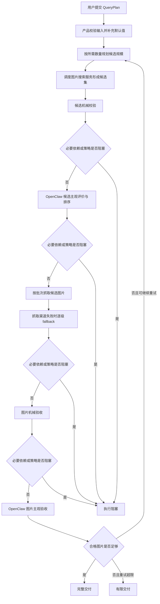

# image-retrieval 产品需求文档（PRD）

## 修订记录
| 版本 | 日期 | 作者 | 修订内容 | 依据/审批 |
| --- | --- | --- | --- | --- |
| v0.17 | 2026-06-19 | Codex | 修复 PRD 发布验收口径：明确真实服务验证需覆盖所有已启用抓取渠道及禁用/启用边界，将可延期开放问题截止点改为 MVP 后，并修正 USER-01 参考说明。 | 用户指令；项目宪法 [BIZ-01]；产品假设与开放决策 [USER-01]；PRD 边界原则 [M-PRD-12] |
| v0.16 | 2026-06-19 | Codex | 修复开放问题门禁残留：将抓取渠道第四级决策的截止点对齐到 MVP 发布前，避免使用未定义的“抓取渠道冻结前”阶段。 | 用户指令；项目宪法 [BIZ-01]；PRD 边界原则 [M-PRD-12] |
| v0.15 | 2026-06-19 | Codex | 修复 PRD 产品门禁一致性：将抓取渠道“四级/三类”歧义显式列为开放决策，统一真实服务验证前必须决策项，并收紧付费渠道与站点规则的验证边界。 | 用户指令；项目宪法 [BIZ-01]；产品假设 [USER-01]；PRD 边界原则 [M-PRD-12] |
| v0.14 | 2026-06-19 | Codex | 修复 PRD 产品门禁闭环：明确搜索服务权重的产品来源和未指定默认策略，补齐真实服务验证的质量校准进入条件，并要求 MVP 发布前必须通过本地真实服务验证。 | 用户指令；项目宪法 [BIZ-01]；产品假设 [USER-01]；PRD 边界原则 [M-PRD-12] |
| v0.13 | 2026-06-19 | Codex | 修复 PRD 剩余验收措辞：明确禁止来源必须拒绝或阻塞，质量档位校准纳入真实服务验证前必须完成，参考信息进入交付验收，并明确加权随机按发布验证或运行观察判定。 | 用户指令；项目宪法 [BIZ-01]；PRD 边界原则 [M-PRD-12] |
| v0.12 | 2026-06-19 | Codex | 修复 PRD 产品验收与发布门禁口径：补齐阻塞信息/参考信息闭环，明确授权风险默认处理，收紧加权随机产品验收表达，并区分 MVP 前必须决策与可延期问题。 | 用户指令；项目宪法 [BIZ-01]；PRD 边界原则 [M-PRD-12] |
| v0.11 | 2026-06-19 | Codex | 修复 PRD 产品验收闭环：明确 OpenClaw 不可用必须产生执行阻塞，区分基础任务结果可读与自动化工作流增强消费，补齐输出偏好行为，并统一任务结果状态术语。 | 用户指令；项目宪法 [BIZ-01]；PRD 边界原则 [M-PRD-12] |
| v0.10 | 2026-06-19 | Codex | 修复 PRD 验收闭环缺口：补齐 QueryPlan 输出偏好，强化候选 OpenClaw 与质量档位验收，调整任务结果状态语义，并让流程图体现必要依赖或策略阻塞的贯穿出口。 | 用户指令；项目宪法 [BIZ-01]；PRD 边界原则 [M-PRD-12] |
| v0.9 | 2026-06-19 | Codex | 修复 PRD 产品语义缺陷：收紧候选不足与执行阻塞边界，明确 OpenClaw 生产路径不可降级，补齐质量档位产品验收口径，统一加权随机和交付物拒绝信息的验收表达。 | 用户指令；项目宪法 [BIZ-01]；PRD 边界原则 [M-PRD-12] |
| v0.8 | 2026-06-19 | Codex | 修复产品语义自洽性：明确合法任务的有限交付可为 0 张、输入错误不是交付状态、默认质量产品口径、候选短缺收口、机械校验产品阻塞类别和验收措辞。 | 用户指令；项目宪法 [BIZ-01]；PRD 边界原则 [M-PRD-12] |
| v0.7 | 2026-06-19 | Codex | 重写为产品需求版，移除实现层说明，仅保留产品目标、流程、需求、验收、交付物与开放决策。 | 用户指令；项目宪法 [BIZ-01]；PRD 边界原则 [M-PRD-12] |
| v0.6 | 2026-06-19 | Codex | 收紧 PRD 边界为产品需求输出，修正 OpenClaw 发布门禁、fixture 验证边界、输入拒绝状态、候选补充策略、retrieval channel 排序策略和参考指标阈值语义。 | 用户指令；项目宪法 [BIZ-01]；仓库 agent 约束 [TECH-01]；PRD 边界原则 [M-PRD-12] |
| v0.5 | 2026-06-19 | Codex | 深度修复 PRD 自洽性：统一重试语义，补齐里程碑、QueryPlan 质量档位、外部服务调度、校验评价、抓取 fallback 和交付状态语义。 | 用户指令；项目宪法 [BIZ-01]；仓库 agent 约束 [TECH-01] |
| v0.4 | 2026-06-19 | Codex | 补充交付物独立产品设计，明确交付状态、交付内容、用户可理解说明和验收。 | 用户指令；项目宪法 [BIZ-01]；仓库 agent 约束 [TECH-01] |
| v0.3 | 2026-06-19 | Codex | 补充 `QueryPlan` 独立产品设计，明确产品输入、默认值、产品规则、校验规则、示例与对应验收。 | 用户指令；项目宪法 [BIZ-01]；仓库 agent 约束 [TECH-01] |
| v0.2 | 2026-06-19 | Codex | 按 `software-prd-writer` 要求重写 PRD，补充来源标记、成功指标、验收标准、发布回滚、风险与需求追踪矩阵。 | 用户指令；项目宪法 [BIZ-01]；仓库 agent 约束 [TECH-01]；PRD 写作方法 [M-PRD-03], [M-PRD-04] |
| v0.1 | 2026-06-19 | Codex | 初始产品设计草案，覆盖 QueryPlan、搜索、抓取、验收、重试和交付包。 | 用户指令；项目宪法 [BIZ-01] |

## 文档概述
| 项目 | 内容 |
| --- | --- |
| 文档目的 | 定义 `image-retrieval` 第一版的产品目标、范围、用户流程、需求、验收标准、交付物、发布边界和开放决策，不定义内部系统设计、数据结构、文件格式或实现方案。 | [BIZ-01], [M-PRD-04], [M-PRD-12] |
| 目标读者 | 产品负责人、工程负责人、QA、安全/合规评审者、OpenClaw 集成决策方，以及后续负责细化技术设计的人员。 | [BIZ-01], [M-PRD-04] |
| 适用版本 | v0.1 MVP：基于 QueryPlan 的图片搜索、候选筛选、分批抓取、图片验收、重试控制和交付包生成。 | [BIZ-01] |
| 当前状态 | 产品需求评审中；OpenClaw 接入方式、默认真实搜索服务、授权风险阻塞细则、抓取渠道第四级是否存在等仍需用户决策。 | [BIZ-01] |

本 PRD 是产品设计结果，只回答“要解决什么问题、面向谁、产品必须表现出什么行为、怎样判断交付成功”。搜索服务接入方式、抓取实现、校验算法、数据结构、配置格式、文件布局和测试方案均应进入后续专项设计。 [BIZ-01], [M-PRD-12]

## 背景与问题
用户希望用自然语言描述图片需求，并自动获得数量足够、质量可控、来源可追溯的图片交付包。项目宪法已经明确产品主线：根据 QueryPlan 搜索候选图片，筛选和排序候选，分批抓取图片，验收图片，最终构建交付包。 [BIZ-01]

当前问题不是缺少某一个搜索服务或抓取手段，而是缺少一个稳定的产品闭环：用户输入如何转化为候选规模，候选如何被过滤，抓取失败如何 fallback，图片如何被验收，无法完整满足时如何诚实交付。 [BIZ-01]

## 目标与成功指标
| ID | 目标 | 成功指标 | 来源 |
| --- | --- | --- | --- |
| G-001 | 用户能从一个 QueryPlan 获得明确的任务结果。 | 输入不合法时必须被拒绝并说明原因；合法任务必须进入完整交付、有限交付或执行阻塞三类结果之一。 | [BIZ-01] |
| G-002 | 搜索候选规模符合宪法比例。 | 每个所需交付图片默认对应约 20 个候选图片；多图需求按所需数量扩大候选规模。 | [BIZ-01] |
| G-003 | 抓取过程符合宪法批次规则。 | 每批抓取候选数量为所需交付图片数量的 2 倍；候选不足时必须回到搜索补充，而不是反复消耗同一批候选。 | [BIZ-01] |
| G-004 | 图片接受结果可解释。 | 每张交付图片和主要拒绝类别都能被用户理解，包括机械校验、主观评价、来源风险和未满足原因。 | [BIZ-01] |
| G-005 | 外部搜索服务与抓取渠道可替换。 | 产品支持配置多个搜索服务和多级抓取渠道，并在用户可理解的规则下调度与 fallback。 | [BIZ-01] |
| G-006 | 交付物可被人工和自动化流程消费。 | 交付包必须包含可用图片、任务结果状态、来源说明、质量说明、风险提示和任务摘要。 | [BIZ-01], [USER-01] |

守护指标：产品不得鼓励或执行绕过登录、付费墙、访问控制或站点授权限制的行为；不得把未知授权图片描述为可商用；不得向用户暴露密钥或敏感凭据。 [BIZ-01]

## 用户与使用场景
| 用户/角色 | 核心需求 | 典型场景 | 来源 |
| --- | --- | --- | --- |
| 内容生产者 | 输入图片语义描述后，获得数量合适、质量稳定、可追溯的图片包。 | 为文章、课程、视频、演示材料或内容草稿寻找配图素材。 | [BIZ-01], [USER-01] |
| 自动化 Agent / 工作流 | 调用本地工具获得稳定交付结果，并把图片交付包传递给后续流程。 | 上游内容生产流程生成 QueryPlan，下游读取任务结果状态和图片清单继续制作。 | [BIZ-01], [USER-01] |
| 产品/QA/安全评审者 | 判断工具是否按宪法完成搜索、筛选、抓取、验收、重试和有限交付。 | 检查交付结果是否诚实、可解释、可追溯且不越过合规边界。 | [BIZ-01] |
| 外部服务集成方 | 接入或替换搜索服务、抓取渠道、主观评价能力。 | 接入 Brave Image Search、其他图片搜索服务、自托管抓取能力或付费抓取服务。 | [BIZ-01] |

## 范围定义
| 类型 | 内容 | 说明 | 来源 |
| --- | --- | --- | --- |
| 范围内 | 本地命令行图片搜索与抓取工具。 | 第一版以 CLI 产品形态交付，不建设 Web UI 或 SaaS 服务。 | [BIZ-01], [TECH-01] |
| 范围内 | QueryPlan 产品输入。 | QueryPlan 必须表达图片语义、交付数量、质量偏好、约束和输出偏好，并提供合理默认值。 | [BIZ-01] |
| 范围内 | 图片搜索服务调度。 | 支持多个可配置搜索服务，并按加权随机原则选择服务形成候选集。 | [BIZ-01] |
| 范围内 | 候选筛选与排序。 | 候选必须经过机械校验和 OpenClaw 主观评价后才能进入抓取优先序列。 | [BIZ-01] |
| 范围内 | 分批抓取与多级 fallback。 | 抓取渠道按已明确的普通 web fetch、自托管开源服务、付费在线服务逐级 fallback；宪法中“四级”与已列类别不一致，第四级是否存在或是否需要拆分现有类别需升级用户决策。 | [BIZ-01] |
| 范围内 | 图片验收与重试。 | 图片必须同时通过机械验收和 OpenClaw 主观验收；不足时按宪法重复流程，超限后有限交付。 | [BIZ-01] |
| 范围内 | 交付包。 | 交付包必须呈现图片、任务结果状态、来源、质量、风险、拒绝原因和未满足原因。 | [BIZ-01] |
| 范围外 | Web UI、多用户服务端、任务队列、账号体系、SaaS 化能力。 | 第一版只定义本地 CLI 产品。 | [BIZ-01], [TECH-01] |
| 范围外 | 图片编辑、裁剪、抠图、超分、生成式补图。 | 产品负责搜索、抓取、验收和交付，不负责图片再加工。 | [BIZ-01] |
| 范围外 | 绕过登录墙、付费墙、访问控制或反爬限制。 | 这类行为不属于产品能力。 | [BIZ-01] |
| 约束 | OpenClaw 生产接入方式尚未确定。 | 产品要求生产路径必须使用 OpenClaw；具体协议不是 PRD 内容，需后续决策。 | [BIZ-01], [M-PRD-12] |
| 假设 | 默认质量档位为通用质量。 | PRD 冻结默认档位和质量档位的产品验收口径；授权风险默认处理口径已定义，授权风险阻塞细则和默认真实搜索服务仍需用户确认。 | [USER-01], [BIZ-01] |

## QueryPlan 产品设计
QueryPlan 是一次图片交付任务的产品级输入。它的核心是图片语义描述，同时必须表达用户要几张图、希望达到什么质量、有哪些必须包含或避免的内容、是否有授权偏好，以及结果希望如何被消费。 [BIZ-01]

| 产品项 | 产品要求 | 默认策略 | 来源 |
| --- | --- | --- | --- |
| 图片语义描述 | 必须能表达用户想要的主体、场景、风格、用途或构图意图。 | 无默认值，缺失时不能启动任务。 | [BIZ-01] |
| 交付数量 | 必须表达最终希望获得的合格图片数量。 | 未填写时默认为 1 张。 | [BIZ-01] |
| 质量偏好 | 必须支持通用质量、较高质量、严格质量等产品档位。 | 未填写时使用通用质量档位。 | [BIZ-01], [USER-01] |
| 内容约束 | 用户可以说明必须包含或应避免的主体、风格、场景、风险元素。 | 未填写时不附加额外内容约束。 | [BIZ-01], [USER-01] |
| 授权偏好 | 用户可以表达对授权风险的偏好；未知授权必须保持风险提示，明确禁止或明显不允许继续使用的来源必须被阻塞或拒绝。 | 未填写时按未知授权处理，不得标记为可商用；授权风险阻塞细则需在 MVP 发布前确认。 | [BIZ-01] |
| 输出偏好 | 用户可以表达交付结果的消费偏好，例如面向人工查看或自动化工作流继续消费。人工查看偏好要求结果说明更便于人工理解；自动化偏好要求任务结果状态、成功/失败原因和图片清单保持稳定可判读。 | 未填写时按本地 CLI 默认交付体验处理，但交付结果仍必须可被用户理解，并提供稳定的任务结果状态。 | [BIZ-01], [USER-01] |
| 重试策略 | 必须遵守“初次尝试后最多重复 3 次”的宪法限制。 | 未填写时最多重复 3 次。 | [BIZ-01] |

QueryPlan 合法后，产品必须派生两条执行规则：搜索候选目标约为所需交付数量的 20 倍；每批抓取候选数量为所需交付数量的 2 倍。非法 QueryPlan 不得进入搜索、抓取或交付流程，必须直接向用户说明输入问题。 [BIZ-01]

质量档位用于表达用户对图片可用性的产品期望，不定义底层算法或实现阈值。通用质量要求图片适合常规配图，不能存在明显损坏、主体不可辨认、严重模糊、明显低质或与 QueryPlan 明显不符的问题；较高质量在通用质量之上，要求主体清晰、构图可用、视觉干扰少，并更稳定地贴合用户用途；严格质量在较高质量之上，要求语义匹配、视觉可用性和内容约束都更保守地通过，不确定或边界图片应优先拒绝或降低优先级。任何质量档位都不得把未知授权描述为可商用或无风险。 [BIZ-01], [USER-01]

## 搜索与候选产品要求
| 产品项 | 产品要求 | 来源 |
| --- | --- | --- |
| 搜索服务接入 | 产品必须允许接入多个外部图片搜索服务；具体接入方式不在 PRD 中定义。 | [BIZ-01], [M-PRD-12] |
| 服务调度 | 当多个搜索服务可用时，产品必须按加权随机原则选择服务，并保留服务来源说明；搜索服务权重属于产品运行决策输入，未指定时所有已启用服务按等权处理；产品验收应在发布验证或运行观察中关注一组可观察任务，高权重服务不应长期低于低权重服务，且结果必须能解释候选来源；单次任务不得作为调度失败的判定依据。 | [BIZ-01], [USER-01] |
| 候选规模 | 每个交付图片需求默认获取约 20 个候选；多图需求按交付数量扩大候选目标。 | [BIZ-01] |
| 候选不足 | 单个服务候选不足时，必须继续补充或切换到其他可用服务；全部服务不足时，本轮可使用已有候选继续后续流程，并在后续重试或有限交付中说明候选短缺。候选短缺本身不得作为执行阻塞，除非同时存在必要生产依赖不可用或产品策略禁止继续。 | [BIZ-01] |
| 候选去重 | 候选集应避免重复候选影响质量和效率。 | [BIZ-01] |
| 候选排序 | 候选必须经过机械校验和 OpenClaw 主观评价后排序，不能仅依赖搜索服务原始排序。 | [BIZ-01] |

## 校验与评价产品要求
候选阶段和图片阶段都必须包含机械判断与主观评价。机械判断负责明确、可自动判断的拒绝条件；主观评价负责语义匹配、视觉质量、风险和适配度判断。 [BIZ-01]

| 阶段 | 机械判断的产品作用 | 主观评价的产品作用 | 通过条件 | 来源 |
| --- | --- | --- | --- | --- |
| 候选阶段 | 产出阻塞信息和参考信息；阻塞信息用于剔除无法访问、明显重复、明显不符合 QueryPlan、明显低于质量档位或存在不可接受风险的候选，参考信息用于支持 OpenClaw 主观评价和风险说明。 | 基于参考信息判断候选是否与 QueryPlan 语义、质量偏好和约束方向一致。 | 机械判断未阻塞，且主观评价认可后，候选才能进入抓取优先序列。 | [BIZ-01] |
| 图片阶段 | 产出阻塞信息和参考信息；阻塞信息用于剔除下载失败、损坏、明显重复、明显不符合 QueryPlan、明显低于质量档位或存在不可接受风险的图片，参考信息用于支持 OpenClaw 主观验收和风险说明。 | 基于参考信息判断实际图片是否满足语义、审美、可用性和风险要求。 | 机械验收和主观验收都通过后，图片才能计入合格交付。 | [BIZ-01] |

参考信息必须提供给主观评价使用，并进入用户可理解的质量或风险说明；参考信息只能辅助主观评价和风险说明，不能在未被产品策略明确设为阻塞条件时单独拒绝候选或图片。生产路径的主观评价必须由 OpenClaw 执行；fixture 或 mock 只能用于内部验证，不能作为生产交付依据。 [BIZ-01]

## 抓取渠道产品要求
| 产品项 | 产品要求 | 来源 |
| --- | --- | --- |
| 渠道分级 | PRD 仅确认宪法已明确列出的普通 web fetch、自托管开源服务、付费在线服务三类抓取渠道；宪法中“四级”与已列类别不一致，第四级不得被隐式补全，需作为开放问题升级用户决策。 | [BIZ-01] |
| 优先级 | 产品必须优先使用免费、高效、合规的渠道；只有在需要 fallback 时才逐级升级。 | [BIZ-01] |
| 批次规模 | 每批抓取候选数量必须为所需交付数量的 2 倍。 | [BIZ-01] |
| fallback | 当前渠道无法获取可验收图片时，必须按等级 fallback；如果失败原因涉及访问控制或授权限制，不得通过升级渠道绕过限制。 | [BIZ-01] |
| 付费渠道 | 付费在线服务默认不应启用，必须由用户明确配置或确认。 | [BIZ-01], [USER-01] |

## 交付物产品设计
交付物是用户最终消费的产品结果。它必须清楚地区分完整交付、有限交付和执行阻塞，不能把有限交付包装成完整成功。 [BIZ-01]

| 任务结果状态 | 触发条件 | 用户可获得内容 | 来源 |
| --- | --- | --- | --- |
| 完整交付 | 合格图片数量达到 QueryPlan 要求。 | 所需数量的合格图片、来源说明、质量说明、风险提示和任务摘要。 | [BIZ-01] |
| 有限交付 | 初次尝试加最多 3 次重复后，合格图片数量仍少于 QueryPlan 要求。 | 实际合格图片、缺口说明、主要失败原因、来源和风险提示；实际合格图片可以为 0 张。 | [BIZ-01] |
| 执行阻塞 | 合法 QueryPlan 尚未完成宪法要求的流程，但必要生产依赖不可用或产品策略禁止继续。 | 阻塞原因、已完成流程摘要、风险说明和后续调整建议；不得伪装成完整或有限交付。 | [BIZ-01] |
| 输入拒绝 | QueryPlan 不合法。 | 输入问题说明；不进入交付流程，不生成看似可消费的交付包。 | [BIZ-01] |

交付包必须让用户知道：交付了哪些图片、每张图片来自哪里、为何被接受、主要风险是什么、候选或图片的主要拒绝类别与必要样例、未完整交付时差多少以及为什么。具体文件格式、目录组织、命名规则和机器可读规范不在 PRD 中定义。 [BIZ-01], [M-PRD-12]

## 用户旅程与核心流程

如果 QueryPlan 输入不合法，流程必须在搜索前停止，并向用户说明输入问题。合法任务在合格图片不足时，必须重复完整流程，直到达到要求或初次尝试加最多 3 次重复均已完成；超过后按实际合格图片数量有限交付，即使实际合格图片为 0 张也必须按有限交付说明缺口和原因。只有在必要生产依赖不可用或产品策略禁止继续时，才进入执行阻塞。 [BIZ-01]

## 功能需求
| ID | 优先级 | 需求 | 产品说明 | 来源 | 验收标准 |
| --- | --- | --- | --- | --- | --- |
| FR-001 | P0 | 系统必须支持 QueryPlan 输入。 | QueryPlan 必须覆盖语义描述、交付数量、质量偏好、内容约束、授权偏好、输出偏好和重试策略。 | [BIZ-01] | AC-001 |
| FR-002 | P0 | 系统必须为 QueryPlan 提供默认值。 | 用户未填写数量、质量或重试策略时，产品必须使用清晰、可解释的默认策略。 | [BIZ-01] | AC-002 |
| FR-003 | P0 | 系统必须按 1:20 形成候选规模。 | 每个所需交付图片约获取 20 个候选，多图需求同步扩大。 | [BIZ-01] | AC-003 |
| FR-004 | P0 | 系统必须支持多个图片搜索服务。 | 多个服务之间按加权随机原则调度；服务权重必须有明确产品来源，未指定时按等权处理；产品必须能说明候选来源，并能在发布验证或运行观察的一组可观察任务中呈现与权重高低一致的服务使用趋势。 | [BIZ-01], [USER-01] | AC-004 |
| FR-005 | P0 | 候选必须经过机械校验和 OpenClaw 主观评价。 | 候选只有通过筛选和排序后才能进入抓取批次。 | [BIZ-01] | AC-005 |
| FR-006 | P0 | 系统必须按所需数量的 2 倍进行批次抓取。 | 每批候选规模与交付数量绑定，候选不足时回到搜索补充。 | [BIZ-01] | AC-006 |
| FR-007 | P0 | 系统必须支持已明确抓取渠道的 fallback。 | 优先普通 web fetch，其次自托管开源服务，最后付费在线服务；第四级渠道是否存在或是否需要拆分现有类别待用户决策。 | [BIZ-01] | AC-007 |
| FR-008 | P0 | 图片必须经过机械验收和 OpenClaw 主观验收。 | 只有两类验收都通过，图片才计为合格。 | [BIZ-01] | AC-008 |
| FR-009 | P0 | 系统必须遵守重试和有限交付规则。 | 合格图片不足时重复完整流程；重复次数超过 3 次后按实际合格图片有限交付。 | [BIZ-01] | AC-009 |
| FR-010 | P0 | 系统必须生成交付包。 | 交付包必须清晰呈现任务结果状态、图片、来源、质量、风险、主要拒绝类别、必要拒绝样例和缺口原因。 | [BIZ-01] | AC-010 |
| FR-011 | P0 | 生产路径必须使用 OpenClaw 主观评价。 | OpenClaw 未确定或不可用时，不能把 mock 或 fixture 结果作为生产交付依据，合法任务必须进入执行阻塞。 | [BIZ-01] | AC-011 |
| FR-012 | P1 | 系统应提供用户自助检查能力。 | 用户应能在正式运行前发现 QueryPlan、搜索服务、抓取渠道或 OpenClaw 配置问题。 | [USER-01], [BIZ-01] | AC-012 |
| FR-013 | P1 | 系统应支持自动化工作流增强消费交付结果。 | 在 P0 交付包已提供稳定任务结果状态的基础上，产品应进一步支持自动化调用方稳定消费交付结果、有限交付原因和执行阻塞原因；具体格式由后续设计确定。 | [USER-01], [M-PRD-12] | AC-013 |

## 非功能需求与约束
| ID | 类别 | 要求 | 验收口径 | 来源 |
| --- | --- | --- | --- | --- |
| NFR-001 | 可解释性 | 用户必须能理解图片为何被接受、拒绝、有限交付或执行阻塞。 | 抽查交付结果时，关键决策都有清楚原因。 | [BIZ-01] |
| NFR-002 | 合规 | 产品不得绕过登录、付费墙、访问控制或站点授权限制。 | 使用受限来源验证时，产品必须拒绝或提示风险，而不是绕过限制。 | [BIZ-01] |
| NFR-003 | 授权风险 | 未知授权不得被描述为可商用或无风险。 | 交付结果必须保留未知授权或风险提示。 | [BIZ-01] |
| NFR-004 | 可扩展性 | 搜索服务、抓取渠道和主观评价能力必须能被替换或扩展。 | 产品需求允许新增服务或渠道，不改变主流程和交付语义。 | [BIZ-01] |
| NFR-005 | 可靠性 | 外部服务不可用时，产品必须给出明确 fallback、有限交付或执行阻塞结果。 | 故障场景下不能静默接受不合格图片，也不能无限重试。 | [BIZ-01] |
| NFR-006 | 安全 | 密钥、凭据和敏感配置不得出现在用户交付结果中。 | 交付包和用户可见日志不得包含敏感凭据。 | [BIZ-01] |

## 数据、埋点与度量方案
| ID | 指标 | 定义 | 用途 | 来源 |
| --- | --- | --- | --- | --- |
| MET-001 | 任务结果分布 | 输入拒绝、完整交付、有限交付、执行阻塞的占比。 | 判断产品闭环是否稳定。 | [BIZ-01], [M-PRD-03] |
| MET-002 | 候选满足率 | 实际候选数量相对目标候选数量的满足程度。 | 判断搜索服务是否足够支撑需求。 | [BIZ-01] |
| MET-003 | 合格图片达成率 | 合格图片数量相对用户所需数量的达成程度。 | 判断质量和抓取策略是否有效。 | [BIZ-01] |
| MET-004 | 主要拒绝原因 | 候选或图片被拒绝的高频原因。 | 指导质量默认值、搜索策略和用户输入建议调整。 | [BIZ-01] |
| MET-005 | 抓取渠道有效性 | 各已明确抓取渠道对最终合格图片的贡献。 | 判断 fallback 顺序、付费渠道必要性，以及是否需要补充第四级渠道决策。 | [BIZ-01] |
| MET-006 | OpenClaw 评价通过率 | 主观评价通过、拒绝和不确定的比例。 | 判断主观评价策略是否过严或过松。 | [BIZ-01] |

## 验收标准
| ID | 对应需求 | 验收标准 | 来源 |
| --- | --- | --- | --- |
| AC-001 | FR-001 | 给定一个包含语义描述的 QueryPlan，系统能够识别用户想要的图片、数量、质量、约束、授权偏好和输出偏好；缺少语义描述时必须拒绝启动。 | [BIZ-01] |
| AC-002 | FR-002 | 给定用户未填写数量、质量或重试策略，系统必须使用默认策略，并能向用户说明默认策略。 | [BIZ-01] |
| AC-003 | FR-003 | 给定用户要求 3 张图片，系统必须以约 60 个候选作为搜索目标，并在候选不足时说明原因。 | [BIZ-01] |
| AC-004 | FR-004 | 给定多个已启用搜索服务，系统必须按加权随机原则使用服务；当用户或产品负责人未指定服务权重时，所有已启用服务必须按等权产品口径处理；在发布验证或运行观察的一组可观察任务中，高权重服务不应长期低于低权重服务，并能在结果中说明候选来自哪些服务；单次任务不得作为调度失败的判定依据。 | [BIZ-01], [USER-01] |
| AC-005 | FR-005 | 给定候选图片集合，候选必须先经过机械校验并产出阻塞信息与参考信息，再经过 OpenClaw 主观评价后才能进入抓取优先序列；明显无效、语义不匹配或低于质量档位的候选必须被拒绝或降低优先级；明确禁止继续使用的候选必须被拒绝或阻塞，并说明原因。 | [BIZ-01] |
| AC-006 | FR-006 | 给定用户要求 4 张图片，每批抓取候选数量必须为 8；候选不足时不得无限重复同一批候选。 | [BIZ-01] |
| AC-007 | FR-007 | 给定低级抓取渠道失败，系统必须尝试下一级可用渠道；若失败原因涉及访问控制或授权限制，不得通过 fallback 绕过。 | [BIZ-01] |
| AC-008 | FR-008 | 给定一张已抓取图片，机械验收必须产出阻塞信息与参考信息；只有机械验收和 OpenClaw 主观验收都通过，且满足 QueryPlan 质量档位，才可以计入合格图片；较高或严格质量档位下，不确定或边界图片不得被当作普通通过。 | [BIZ-01] |
| AC-009 | FR-009 | 给定初次尝试和最多 3 次重复后仍未达到所需数量，系统必须按实际合格图片数量有限交付；没有合格图片时必须有限交付 0 张并说明缺口原因。 | [BIZ-01] |
| AC-010 | FR-010 | 给定完整交付、有限交付或执行阻塞，系统必须让用户看到任务结果状态、原因、来源、风险、主要拒绝类别、必要拒绝样例和下一步可调整方向；质量或风险说明必须使用机械校验产生的参考信息；给定自动化输出偏好，系统必须让后续流程稳定判断任务结果状态。 | [BIZ-01], [USER-01] |
| AC-011 | FR-011 | 给定生产模式下 OpenClaw 不可用，系统不得把 mock 或 fixture 评价结果当作生产验收通过，必须把合法任务标记为执行阻塞，并说明阻塞原因。 | [BIZ-01] |
| AC-012 | FR-012 | 给定用户在正式运行前检查任务，系统必须暴露 QueryPlan、搜索服务、抓取渠道或 OpenClaw 相关的阻塞问题。 | [USER-01], [BIZ-01] |
| AC-013 | FR-013 | 给定自动化调用方按增强消费方式读取交付结果，系统必须让调用方稳定消费任务结果状态、交付图片、有限交付原因和执行阻塞原因。 | [USER-01], [BIZ-01] |

## 发布、灰度与回滚
| 阶段 | 范围 | 进入条件 | 观察重点 | 回滚条件 | 来源 |
| --- | --- | --- | --- | --- | --- |
| 内部 fixture 验证 | 使用离线搜索、离线抓取和 mock 主观评价验证产品闭环。 | QueryPlan、候选规模、批次抓取、验收、重试、任务结果状态均可被验证。 | 流程是否完整、状态是否清晰、拒绝原因是否可解释。 | 任一 P0 产品规则无法验证。 | [BIZ-01] |
| 本地真实服务验证 | 使用至少一个真实搜索服务、OpenClaw 生产评价、普通抓取渠道，并覆盖所有已启用抓取渠道的 fallback 表现；未启用的自托管或付费渠道必须验证其禁用边界和用户可见说明。 | OpenClaw 决策已完成，默认真实搜索服务、真实服务凭据、基础合规策略、搜索服务权重默认口径和真实服务验证阶段的付费渠道边界已确认；质量档位校准已完成，或已有明确可接受的校准放行决策。 | 候选满足率、合格图片达成率、主要拒绝原因、OpenClaw 输出完整性、已启用抓取渠道 fallback 表现、未启用渠道边界说明、是否需要补充第四级抓取渠道。 | 出现绕过访问控制、错误授权声明、OpenClaw 缺失、不可解释接受，或已启用抓取渠道 fallback 无法满足 P0 验收。 | [BIZ-01], [USER-01] |
| MVP 发布 | 面向本地 CLI 用户发布。 | 所有 P0 验收通过，本地真实服务验证已通过，MVP 前必须决策项已关闭，可延期开放问题已有明确放行或延期决策。 | 完整交付率、有限交付原因、执行阻塞原因、用户调整成本。 | 发现错误任务结果状态、合规风险、敏感凭据暴露或 mock 被用于生产交付。 | [BIZ-01] |

回滚时必须保留执行阻塞和风险证据；用户不应因为回滚而失去对已发生任务的解释。 [BIZ-01]

## 依赖、风险与开放问题
| 类型 | ID | 内容 | 影响 | 负责人 | 截止日期 | 状态 | 来源 |
| --- | --- | --- | --- | --- | --- | --- | --- |
| 依赖 | DEP-001 | 需要确定 OpenClaw 生产评价的使用方式和责任边界。 | 影响候选主观评价和图片主观验收能否进入生产发布。 | 用户/产品负责人 | MVP 发布前 | MVP 前必须决策 | [BIZ-01] |
| 依赖 | DEP-002 | 需要确定第一版默认真实图片搜索服务。 | 影响真实服务验证范围和用户配置复杂度。 | 用户/产品负责人 | 真实服务验证前 | 真实服务验证前必须决策 | [BIZ-01], [USER-01] |
| 风险 | RISK-001 | 质量档位的产品口径已定义，但尚未经过真实任务校准；未完成校准或放行决策时，不应进入本地真实服务验证。 | 过高会导致有限交付增多，过低会降低图片可用性。 | 产品负责人 | 真实服务验证前 | 真实服务验证前必须校准或放行 | [USER-01] |
| 风险 | RISK-002 | 授权风险默认按未知提示、明确禁止阻塞或拒绝处理；授权风险阻塞细则尚未确认。 | 影响合格图片数量和合规姿态。 | 用户/安全评审 | MVP 发布前 | MVP 前必须决策 | [BIZ-01] |
| 风险 | RISK-003 | OpenClaw 不可用时生产任务必须执行阻塞，不能降级为 mock、fixture 或跳过主观评价。 | 影响任务成功率，但保护宪法要求和交付可信度。 | 用户/产品负责人 | MVP 发布前 | 约束已定义 | [BIZ-01] |
| 风险 | RISK-004 | 付费抓取渠道的启用边界未决；真实服务验证前必须至少确认验证阶段是否允许启用付费渠道。 | 影响成本控制、真实服务验证范围和 fallback 策略。 | 用户/产品负责人 | 真实服务验证前 | 真实服务验证前必须决策 | [BIZ-01], [USER-01] |
| 开放问题 | OQ-001 | 是否需要设置单个 QueryPlan 的最大交付数量。 | 影响成本、耗时、候选规模和有限交付概率；MVP 可先通过用户自助检查和有限交付说明暴露大数量风险。 | 用户/产品负责人 | MVP 发布后 | 可延期开放问题 | [BIZ-01] |
| 开放问题 | OQ-002 | 交付结果是否需要按授权风险分组展示。 | 影响用户消费图片时的风险判断；MVP 必须保留授权风险提示，分组展示可作为后续体验增强。 | 用户/产品负责人 | MVP 发布后 | 可延期开放问题 | [BIZ-01], [USER-01] |
| 开放问题 | OQ-003 | 是否默认启用站点规则或 robots 风险提示。 | 影响可抓取范围、基础合规策略和真实服务验证入口。 | 用户/安全评审 | 真实服务验证前 | 真实服务验证前必须决策 | [BIZ-01] |
| 开放问题 | OQ-004 | 宪法中提到抓取渠道“四级”，但当前仅明确列出普通 web fetch、自托管开源服务、付费在线服务三类；需确认第四级是否存在、是否为表述误差，或是否需要拆分现有类别。 | 影响抓取渠道产品范围、fallback 验收和后续技术设计输入。 | 用户/产品负责人 | MVP 发布前 | MVP 前必须决策 | [BIZ-01] |

## 需求追踪矩阵
| 来源 | 目标 | 需求 | 验收标准 | 指标 | 状态 |
| --- | --- | --- | --- | --- | --- |
| [BIZ-01] | G-001 | FR-001, FR-002, FR-009, FR-010 | AC-001, AC-002, AC-009, AC-010 | MET-001, MET-003 | 已定义 |
| [BIZ-01] | G-002 | FR-003, FR-004 | AC-003, AC-004 | MET-002 | 已定义 |
| [BIZ-01] | G-003 | FR-006, FR-007 | AC-006, AC-007 | MET-005 | 已定义 |
| [BIZ-01] | G-004 | FR-005, FR-008, FR-011 | AC-005, AC-008, AC-011 | MET-004, MET-006 | 已定义 |
| [BIZ-01], [USER-01] | G-005 | FR-004, FR-007, FR-012 | AC-004, AC-007, AC-012 | MET-002, MET-005 | 已定义 |
| [BIZ-01], [USER-01] | G-006 | FR-010, FR-013 | AC-010, AC-013 | MET-001, MET-003 | 已定义 |
| [M-PRD-03], [M-PRD-04], [M-PRD-12] | 文档可评审性 | 全部 P0/P1 需求 | 全部验收标准 | 全部指标 | 已定义 |

## 参考文献
| 标记 | 来源 | 说明 |
| --- | --- | --- |
| [BIZ-01] | 用户在当前会话中提供的项目宪法：通用图片搜索与抓取工具、QueryPlan、provider、校验、OpenClaw、retrieval channel、批次抓取、验收、重复次数超过 3 次后有限交付规则。 | 产品事实与不可违反流程来源。 |
| [USER-01] | 当前 PRD 中标记为产品假设或开放决策的用户画像、默认质量档位、默认真实搜索服务待决、付费渠道范围和自动化消费需求。 | 尚未由访谈、数据或明确用户决策完全验证的产品假设与开放决策。 |
| [TECH-01] | `/Users/royzuo/github/image-retrieval/AGENTS.md` | 仓库级边界：本项目为 Rust CLI，且必须遵守产品宪法。 |
| [M-PRD-03] | Productboard, Product Requirements Document | PRD 应面向结果、保持简洁，并覆盖成功指标、角色、范围、假设、风险、约束和依赖。 |
| [M-PRD-04] | ProductPlan, Product Requirements Document | PRD 应帮助产品、工程、测试、UX 和相关职能对发布能力形成共识。 |
| [M-PRD-12] | Diataxis, Documentation framework | 不同文档类型应保持边界清晰；本 PRD 不下探为技术规格、参考手册或实现设计。 |
