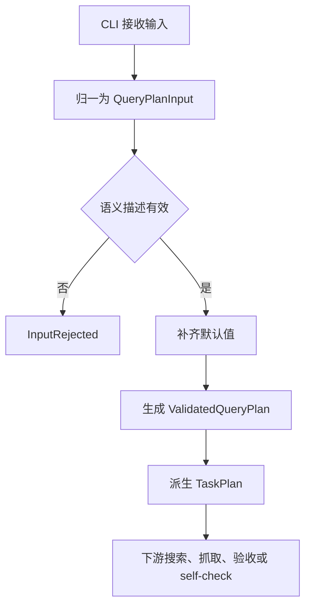
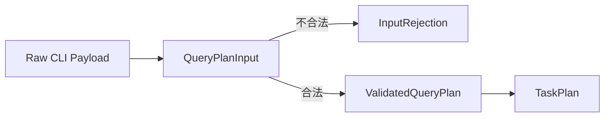

# QueryPlan CLI 与输入规划详细设计

## 修订记录

| 版本 | 日期 | 作者 | 修订内容 | 依据 |
| --- | --- | --- | --- | --- |
| v0.2 | 2026-06-19 | Codex | 按文档编写要求重写为简体中文正式文档，强化结构、表格、追溯和参考文献。 | 用户文档编写要求；`tasks/design/design-planning.json` TASK-002 |
| v0.1 | 2026-06-19 | Codex | 完成 QueryPlan 输入、默认值、派生规划值和输入拒绝详细设计。 | PRD v0.17；HLD v0.11 |

## 文档目的

本文定义 TASK-002 的最终详细设计结论，面向后续实现者、测试者和评审者。本文说明 QueryPlan 输入契约、CLI 命令边界、默认值、派生规划值、输入拒绝诊断和移交关系。本文不规定具体 CLI parser、序列化库或命令语法。

固定交付位置为 `docs/design/TASK-002-queryplan-cli-input-planning-design.md`。规划输出覆盖：QueryPlan input contract design；CLI command boundary design；defaulting and derived planning value design；input rejection diagnostics design。

## 来源与追溯

| 来源标记 | 设计依据 |
| --- | --- |
| `docs/PRD.md:75-90` | QueryPlan 产品项、默认值、质量档位和派生规则。 |
| `docs/PRD.md:201-202` | AC-001、AC-002 输入识别与默认值验收。 |
| `docs/HLD.md:77-79` | QueryPlan、候选目标、批次规模和重试约束。 |
| `docs/HLD.md:204-206` | CLI Adapter 与 QueryPlan Planner 的职责边界。 |

## 范围边界

| 类别 | 内容 |
| --- | --- |
| 范围内 | QueryPlan 输入归一、校验、默认值、派生候选目标、派生抓取批次目标、重试规划、CLI 命令边界、输入拒绝诊断。 |
| 范围外 | provider readiness、channel readiness、OpenClaw readiness、交付包布局、具体 CLI parser、具体字段序列化格式。 |
| 禁止事项 | 不得实现代码，不得改变 PRD 默认值，不得选择未决依赖，不得把输入拒绝包装成正式交付结果。 |

## 输入契约

QueryPlan 是一次图片交付任务的产品级输入。其内部设计应区分“用户输入缺省”和“系统默认补齐”，避免后续模块无法解释默认值来源。

| 字段 | 必填 | 默认值 | 设计结论 |
| --- | --- | --- | --- |
| 图片语义描述 | 是 | 无 | 缺失时输入拒绝。 |
| 交付数量 | 否 | 1 | 合法后派生候选目标和批次目标。 |
| 质量偏好 | 否 | 通用质量 | 只表达产品档位，不绑定算法阈值。 |
| 内容约束 | 否 | 无额外约束 | 传递给候选和图片评价。 |
| 授权偏好 | 否 | 未知授权风险 | 不得默认商用安全。 |
| 输出偏好 | 否 | 本地 CLI 默认体验 | 仍保留稳定任务状态供自动化消费。 |
| 重试策略 | 否 | 初次尝试加最多 3 次重试 | 不得超过宪法边界。 |

## 控制流

正式任务与 self-check 共用同一输入规划逻辑。差异在于正式任务把 `TaskPlan` 交给编排器，self-check 只把校验、默认值和风险诊断交给 readiness 汇总。

## 数据流

`TaskPlan` 必须显式携带：

- `candidate_target = required_count * 20`
- `retrieval_batch_target = required_count * 2`
- `retry_limit = 3`
- 质量偏好、内容约束、授权偏好和输出偏好

下游模块不得重复解释 QueryPlan 默认值。

## 接口与类型

| 类型族 | 说明 |
| --- | --- |
| `QueryPlanInput` | 归一后的外部输入，保留字段缺省状态。 |
| `ValidatedQueryPlan` | 已校验并补齐默认值的内部产品意图。 |
| `TaskPlan` | 可执行规划值，供调度、候选门禁、抓取和验收使用。 |
| `InputDiagnostic` | 字段级诊断，包含原因、严重度和调整建议。 |
| `InputRejection` | 前置输入拒绝，不属于交付结果状态。 |

## 状态与持久化

输入规划状态包括 `received`、`normalized`、`rejected`、`planned` 和 `self_check_ready`。MVP 不需要数据库持久化；正式任务的持久化边界由交付包设计承担。

输入拒绝发生在搜索前，不产生 `FullDelivery`、`LimitedDelivery` 或 `ExecutionBlocked`，也不生成可消费交付包。

## 错误与诊断

诊断类别包括语义描述缺失、数量非法、质量档位未知、内容约束格式不支持、授权偏好不支持、输出偏好不支持、重试策略越界和大数量风险。

诊断必须使用书面、可操作的表达：说明被拒绝字段、拒绝原因、可用默认值和用户可调整方向。最大 QueryPlan 数量尚未决策，因此大数量请求不应在本设计中被硬拒绝，只应作为风险提示移交给 self-check 和交付说明。

## 安全与权限

QueryPlan 不承载凭据。若用户输入中包含疑似 token、cookie 或认证信息，诊断不得回显原值。授权偏好默认未知风险，不能被转换为商用安全声明。

## 可观测性

TASK-002 提供以下指标和事件来源：

| 事件 | 用途 |
| --- | --- |
| 输入通过/拒绝 | 支持任务结果分布。 |
| 默认值应用 | 支持用户解释和 self-check。 |
| 候选目标派生 | 支持候选满足率。 |
| 批次目标派生 | 支持抓取批次验收。 |
| 输出偏好 | 支持自动化消费设计。 |

## 验证与验收

验收结论应覆盖：有语义描述可生成 `ValidatedQueryPlan`；缺失语义描述输入拒绝；缺省数量为 1；缺省质量为通用质量；缺省重试为最多 3 次；要求 3 张图片派生约 60 个候选；要求 4 张图片派生 8 个抓取候选；未知授权保持风险提示。

## 风险与移交

开放风险包括具体 CLI 语法、最大 QueryPlan 数量、具体 parser/serialization 库。移交关系如下：

| 下游任务 | 移交内容 |
| --- | --- |
| TASK-003 | 候选目标、语义描述、约束和授权偏好。 |
| TASK-004 | 质量档位、内容约束和授权风险。 |
| TASK-005 | 抓取批次目标。 |
| TASK-006 | 重试边界和输入拒绝分离。 |
| TASK-007 | 输出偏好和稳定状态需求。 |
| TASK-008 | 输入合法性、默认值解释和大数量风险。 |

## 参考文献

| 标记 | 来源 |
| --- | --- |
| [PRD-01] | `docs/PRD.md` v0.17 |
| [HLD-01] | `docs/HLD.md` v0.11 |
| [PLAN-01] | `tasks/design/design-planning.json` TASK-002 |
