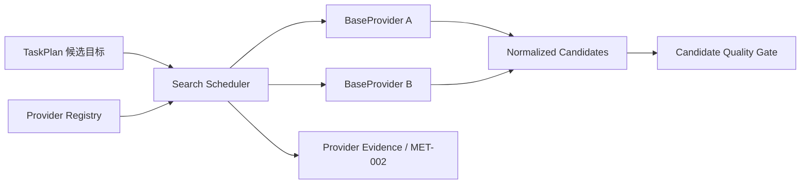

# BaseProvider 搜索调度详细设计

## 修订记录

| 版本 | 日期 | 作者 | 修订内容 | 依据 |
| --- | --- | --- | --- | --- |
| v0.3 | 2026-06-20 | Codex | 补齐加权随机调度的有效权重、抽样粒度、候选补充、可测试随机源和异常配置诊断边界。 | PRD v0.17；HLD v0.11；LLD 深度审阅结论 |
| v0.2 | 2026-06-19 | Codex | 按文档编写要求重写为简体中文正式文档，补充修订表、图表化流程和参考文献。 | 用户文档编写要求；`tasks/design/design-planning.json` TASK-003 |
| v0.1 | 2026-06-19 | Codex | 完成 BaseProvider、加权随机调度、provider readiness 与候选短缺设计。 | PRD v0.17；HLD v0.11 |

## 文档目的

本文定义 TASK-003 的详细设计结论，说明图片搜索服务接入契约、加权随机调度、provider readiness、候选短缺、候选来源追踪和候选满足率证据。本文不选择默认真实搜索服务，不规定任何外部搜索服务协议。

固定交付位置为 `docs/design/TASK-003-base-provider-search-design.md`。规划输出覆盖：BaseProvider trait and adapter boundary design；weighted random scheduling design；provider readiness and candidate shortage design；candidate source attribution design。

## 来源与追溯

| 来源标记 | 设计依据 |
| --- | --- |
| `docs/PRD.md:92-100` | 搜索服务接入、加权随机、候选规模、候选不足、去重和排序要求。 |
| `docs/PRD.md:203-204` | AC-003、AC-004 候选规模与服务调度验收。 |
| `docs/HLD.md:39-40` | `BaseProvider` 接入主流图片搜索引擎且不绑定服务品牌。 |
| `docs/HLD.md:207-209` | Search Scheduler 与 BaseProvider 职责边界。 |
| `AGENTS.md:44-55` | 宪法中的 BaseSearchProvider、可插拔配置与加权随机调度要求。 |

## 范围边界

| 类别 | 内容 |
| --- | --- |
| 范围内 | `BaseProvider` 契约、provider 注册、ready/enabled 状态、加权随机调度、候选去重、来源追踪、候选不足诊断、MET-002 事件来源。 |
| 范围外 | 默认 provider、内置 provider 清单、Brave 等具体 HTTP 协议、凭据格式、搜索结果质量评价。 |
| 禁止事项 | 不得硬编码凭据，不得把 provider 原始响应直接交给质量门禁，不得将单次随机结果当作调度失败。 |

## 架构结论

`BaseProvider` 是搜索服务能力端口，等价承接宪法中的 `BaseSearchProvider`。provider 只负责搜索能力、候选归一、来源说明和失败事实；候选是否可抓取由 TASK-004 决定，图片是否合格由 TASK-006 决定。

## 控制流

| 步骤 | 设计结论 |
| --- | --- |
| 1 | Search Scheduler 接收 `TaskPlan.candidate_target`、语义描述、质量偏好、内容约束和授权偏好。 |
| 2 | Scheduler 读取 provider registry，过滤 disabled provider。 |
| 3 | 对 enabled provider 执行 readiness 检查，缺凭据、配置错误、限流或不可用均形成诊断。 |
| 4 | 生成有效权重表；未指定权重时，对所有可用 provider 等权处理。 |
| 5 | 按加权随机选择 provider 并请求候选，直到达到候选目标、服务耗尽或无可用 provider。 |
| 6 | 对候选做归一和去重，保留 provider 来源、来源页面或搜索结果线索。 |
| 7 | 候选不足时记录短缺原因，任务仍可进入后续流程，除非必要依赖或策略阻塞。 |

## 加权随机调度规则

加权随机调度以“每次 provider 请求”为抽样粒度。Scheduler 在每次需要补充候选时，从当前有效权重表中抽取一个 provider，并记录该次请求、返回候选数、去重后贡献数和失败事实。单次任务的抽样结果不代表调度是否失败；趋势判断只在发布验证或运行观察的一组可观察任务中成立。

| 规则 | 设计结论 |
| --- | --- |
| 有效 provider | 只有 `enabled` 且 readiness 为 `ready` 的 provider 进入有效权重表。 |
| 默认权重 | 用户或产品负责人未指定权重时，有效 provider 统一按权重 `1` 处理。 |
| 异常权重 | 缺失权重按默认权重处理；非数值、负数或零权重属于配置诊断，该 provider 不进入本次有效权重表。 |
| 全部无效 | 若没有有效 provider，任务记录 provider readiness 阻塞事实；正式任务是否执行阻塞由编排器结合必要依赖和策略边界决定。 |
| 候选补充 | 已抽取 provider 返回不足时，Scheduler 继续按当前有效权重表抽样补充；若某 provider 明确耗尽或临时不可用，本次搜索可将其从后续抽样中移除并记录原因。 |
| 去重贡献 | 权重趋势以 provider 请求次数和去重后候选贡献共同观察，避免重复候选虚增贡献。 |
| 测试确定性 | 调度随机源归属于 Scheduler；实现时应允许测试使用可复现随机源，但本文不指定具体随机库。 |

## 并发与超时边界

搜索调度可以在实现阶段对 provider 请求采用有限并发，但并发只影响外部请求的执行效率，不改变候选目标、去重、来源追踪、权重事件和候选短缺语义。

| 主题 | 设计结论 |
| --- | --- |
| 并发上限 | Scheduler 必须具备 provider 请求并发上限；具体上限由后续实现或配置设计确定。 |
| 结果合并 | provider 结果按归一候选、来源和调度事件合并；候选排序不得依赖请求完成先后。 |
| 超时归一 | provider 超时归一为 transient unavailable、rate-limited 或 provider failure 相关诊断，不得伪装为空候选成功。 |
| 取消语义 | 当前 QueryPlan 进入执行阻塞、完整交付或有限交付终态时，未完成搜索请求不得继续写入任务上下文。 |

## 数据流

输入包括 `ValidatedQueryPlan`、`TaskPlan.candidate_target`、provider registry、配置权重和 readiness 事实。输出包括归一候选、来源说明、provider 使用事件、候选满足率证据和候选短缺原因。

原始 provider 响应属于 adapter 私有数据。核心领域只接收 `CandidateRecord`、`CandidateSource`、provider 标识和归一失败类别。

## 接口与类型

| 类型族 | 说明 |
| --- | --- |
| `ProviderId` | 本地稳定 provider 标识。 |
| `ProviderRegistration` | provider 是否启用、权重、能力和配置边界。 |
| `ProviderReadiness` | ready、disabled、missing_credentials、misconfigured、rate_limited、unavailable。 |
| `BaseProvider` | 搜索能力端口，暴露 readiness、能力声明和搜索请求。 |
| `SearchRequest` | 语义描述、约束、质量偏好、候选目标和策略上下文。 |
| `SearchProviderResult` | 候选集合、失败类别、短缺说明和来源证据。 |
| `CandidateRecord` | 供候选质量门禁消费的结构化候选。 |
| `SearchUsageEvent` | provider 调度与候选贡献事件。 |

## 状态与持久化

搜索调度状态是任务内存状态，包括可用 provider 集合、ready 状态、权重表、选择历史、候选数量、去重集合和候选满足率。MVP 不需要数据库。若后续为了趋势观察持久化 provider 使用情况，必须先设计脱敏策略。

## 错误与诊断

错误类别包括 provider disabled、missing credentials、misconfigured、rate-limited、transient unavailable、empty result、unnormalizable response 和 duplicate-only result。

诊断应说明候选不足来自哪个层面：无可用 provider、单 provider 候选不足、全部 provider 候选不足、候选重复过多或响应不可归一。候选短缺本身不是执行阻塞。

## 安全与权限

provider 凭据属于本地配置，不进入候选、指标、交付包或用户可见日志。授权偏好只作为搜索上下文传递，不能由 provider 单独决定图片授权风险结论。

## 可观测性

| 指标事件 | 对应目标 |
| --- | --- |
| 候选目标数量 | MET-002 分母。 |
| 实际候选数量 | MET-002 分子。 |
| 去重后候选数量 | 解释候选满足率。 |
| provider 使用次数与候选贡献 | 验证加权随机趋势。 |
| provider readiness 分布 | 支持 self-check 和真实服务验证。 |
| 候选来源说明 | 支持交付解释。 |

## 验证与验收

验收应确认：要求 3 张图片时候选目标约 60；多个 provider 可按权重参与调度；未指定权重时等权；候选来源可解释；候选不足可继续后续流程并保留说明；provider 凭据不出现在用户可见证据中。

## 风险与移交

开放风险包括默认真实 provider、内置 provider 清单、provider 限流语义和具体协议。移交关系如下：

| 下游任务 | 移交内容 |
| --- | --- |
| TASK-004 | `CandidateRecord`、来源说明、候选短缺证据。 |
| TASK-007 | provider 使用事件、候选满足率和来源追踪。 |
| TASK-008 | provider readiness 与配置诊断。 |

## 参考文献

| 标记 | 来源 |
| --- | --- |
| [PRD-01] | `docs/PRD.md` v0.17 |
| [HLD-01] | `docs/HLD.md` v0.11 |
| [AGENT-01] | `AGENTS.md` |
| [PLAN-01] | `tasks/design/design-planning.json` TASK-003 |
