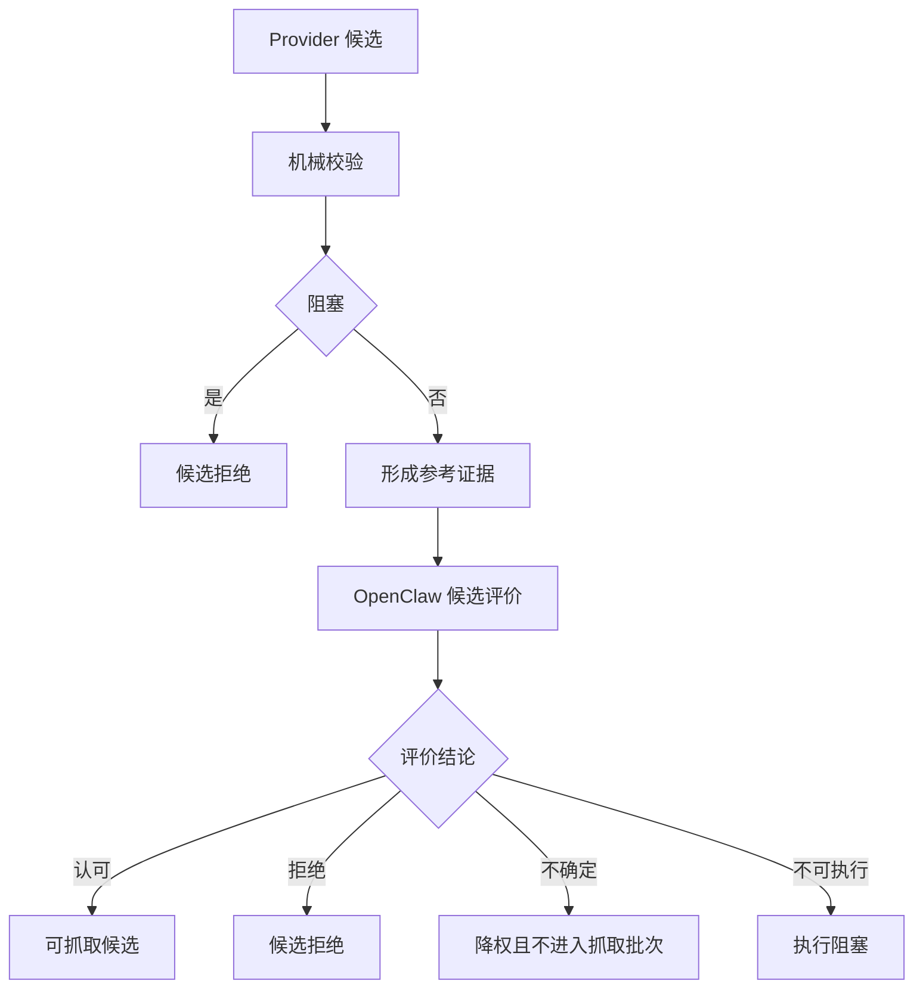

# 候选质量门禁与 OpenClaw 候选评价详细设计

## 修订记录

| 版本 | 日期 | 作者 | 修订内容 | 依据 |
| --- | --- | --- | --- | --- |
| v0.2 | 2026-06-19 | Codex | 按文档编写要求重写为简体中文正式文档，强化候选评价边界、证据流和参考文献。 | 用户文档编写要求；`tasks/design/design-planning.json` TASK-004 |
| v0.1 | 2026-06-19 | Codex | 完成候选机械校验、结构化候选评价和候选决策归一设计。 | PRD v0.17；HLD v0.11 |

## 文档目的

本文定义 TASK-004 的详细设计结论，说明候选机械校验、阻塞/参考证据、结构化搜索结果主观评价、OpenClaw 候选评价结果归一、候选优先级和拒绝证据。本文只处理候选阶段，不处理真实图片验收。

固定交付位置为 `docs/design/TASK-004-candidate-quality-openclaw-design.md`。规划输出覆盖：candidate mechanical validation design；structured candidate evaluation boundary design；OpenClaw candidate evaluation result normalization design；candidate priority and rejection evidence design。

## 来源与追溯

| 来源标记 | 设计依据 |
| --- | --- |
| `docs/PRD.md:102-110` | 候选和图片阶段的机械判断、主观评价、阻塞信息与参考信息。 |
| `docs/PRD.md:205` | AC-005 候选进入抓取优先序列的验收要求。 |
| `docs/HLD.md:210` | Candidate Quality Gate 职责。 |
| `docs/HLD.md:219-233` | 候选评价与图片评价的独立边界及不确定结论归一。 |
| `docs/HLD.md:443-446` | ADR-008 至 ADR-011 中关于 BaseProvider、双评价边界和归一语义的决策。 |

## 范围边界

| 类别 | 内容 |
| --- | --- |
| 范围内 | 候选机械校验、阻塞指标、参考指标、结构化候选评价、OpenClaw 候选评价、候选决策归一、优先级和拒绝证据。 |
| 范围外 | 下载图片、图片验收、最终交付判断、OpenClaw wire protocol、算法阈值。 |
| 禁止事项 | 不得把候选评价当作最终交付验收；不得把不确定候选当作明确通过；不得用 mock/fixture 替代生产 OpenClaw。 |

## 候选门禁模型

候选质量门禁以“先机械、后主观、再归一”为基本结构。

## 控制流

1. Candidate Quality Gate 接收 TASK-003 输出的归一候选、来源说明和候选短缺证据。
2. 机械校验先判断明显不可用、明显重复、明显不符、明显低质或不可接受风险。
3. 被机械阻塞的候选不进入 OpenClaw 候选评价。
4. 未阻塞候选形成参考信息，提供给 OpenClaw。
5. OpenClaw 执行结构化候选评价，判断候选是否符合 QueryPlan 语义、质量偏好和内容约束。
6. 评价不可执行时，合法任务进入执行阻塞。
7. 评价完成后，质量门禁把结论归一为可抓取、拒绝、待补充证据或不确定降权。
8. 只有机械未阻塞且主观明确认可的候选进入 `RetrievableCandidateSequence`。

## 数据流

输入包括 `ValidatedQueryPlan`、质量偏好、内容约束、授权偏好、`CandidateRecord`、来源说明和 provider 证据。输出包括可抓取候选序列、候选拒绝证据、候选 OpenClaw 通过/拒绝/不确定事件、候选参考信息和执行阻塞事实。

参考信息必须进入主观评价请求和后续质量/风险解释，但参考信息本身只有在产品策略明确设为阻塞时才可单独拒绝候选。

## 接口与类型

| 类型族 | 说明 |
| --- | --- |
| `CandidateMechanicalEvidence` | 候选机械校验的阻塞与参考证据。 |
| `CandidateBlockingReason` | 明显无效、重复、语义不符、低质、不可访问、不可接受风险。 |
| `CandidateReferenceSignal` | 来源质量、文本上下文、provider 置信线索、授权风险、重复相似线索。 |
| `CandidateEvaluationRequest` | 提交给 OpenClaw 的结构化候选评价输入。 |
| `CandidateEvaluationConclusion` | 认可、拒绝、不确定、不可执行。 |
| `CandidateDecision` | 可抓取、拒绝、待补充证据、不确定降权、执行阻塞。 |
| `RetrievableCandidateSequence` | TASK-005 唯一可消费的候选序列。 |

## 状态与持久化

候选质量状态属于任务上下文，包括候选全集、机械证据、OpenClaw 请求状态、归一决策、可抓取序列和拒绝摘要。MVP 不需要数据库。用户可见交付只应接收归一证据，不应暴露外部 provider 原始响应。

## 错误与诊断

诊断类别包括机械阻塞、重复候选、证据不足、OpenClaw 拒绝、OpenClaw 不确定、OpenClaw 不可用和候选风险禁止继续。

OpenClaw 不可用或技能不可执行不是候选拒绝，而是生产依赖不可用，应交给编排器形成执行阻塞。OpenClaw 不确定不是执行阻塞，但不得进入可抓取批次。

## 安全与权限

OpenClaw 候选评价请求不得包含 provider 凭据或本地敏感配置。授权风险应作为风险信息传递，未知授权不得被标记为商用安全。明确禁止继续使用的来源必须拒绝或交给策略边界阻塞。

## 可观测性

| 事件 | 指标用途 |
| --- | --- |
| 机械阻塞数量和原因 | MET-004 主要拒绝原因。 |
| OpenClaw 认可/拒绝/不确定/不可执行 | MET-006 评价通过率。 |
| 可抓取候选数量 | 解释抓取批次短缺。 |
| 候选拒绝样例 | 支持交付包解释。 |

## 验证与验收

验收应确认：机械阻塞候选不得进入抓取序列；参考信息提供给 OpenClaw；OpenClaw 明确认可才可抓取；拒绝和不确定候选不进入批次；OpenClaw 生产不可执行形成执行阻塞；候选评价不决定最终交付。

## 风险与移交

开放风险包括 OpenClaw 生产责任边界、具体技能执行模型和质量档位校准。移交关系如下：

| 下游任务 | 移交内容 |
| --- | --- |
| TASK-005 | `RetrievableCandidateSequence`、候选短缺和排除证据。 |
| TASK-006 | 候选/图片评价分离和 OpenClaw 不可执行语义。 |
| TASK-007 | 候选拒绝类别、OpenClaw 事件和解释证据。 |
| TASK-008 | 候选 OpenClaw readiness 与技能可执行性。 |

## 参考文献

| 标记 | 来源 |
| --- | --- |
| [PRD-01] | `docs/PRD.md` v0.17 |
| [HLD-01] | `docs/HLD.md` v0.11 |
| [PLAN-01] | `tasks/design/design-planning.json` TASK-004 |
