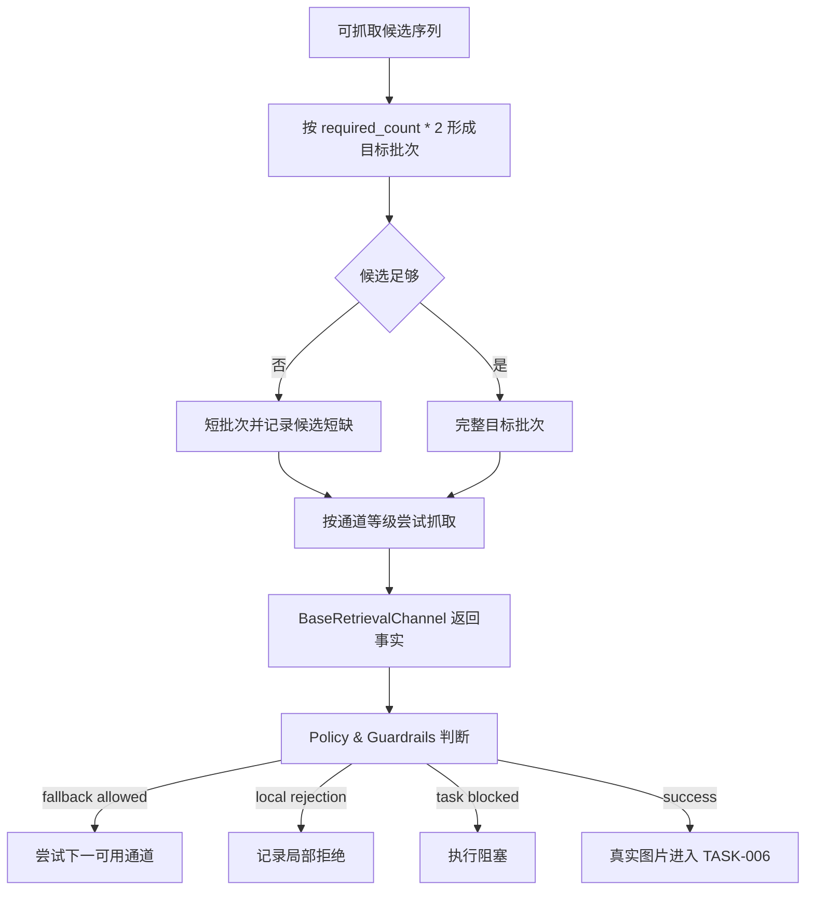

# BaseRetrievalChannel 批次抓取与 fallback 详细设计

## 修订记录

| 版本 | 日期 | 作者 | 修订内容 | 依据 |
| --- | --- | --- | --- | --- |
| v0.3 | 2026-06-20 | Codex | 补齐批次抓取的有限并发、超时取消、结果合并和稳定批次语义。 | PRD v0.17；HLD v0.11；LLD 深度审阅结论 |
| v0.2 | 2026-06-19 | Codex | 按文档编写要求重写为简体中文正式文档，强化 fallback 策略边界、批次语义和参考文献。 | 用户文档编写要求；`tasks/design/design-planning.json` TASK-005 |
| v0.1 | 2026-06-19 | Codex | 完成 BaseRetrievalChannel、目标批次、短批次和 fallback handoff 设计。 | PRD v0.17；HLD v0.11 |

## 文档目的

本文定义 TASK-005 的详细设计结论，说明 `BaseRetrievalChannel` 通道契约、抓取批次规划、短批次、fallback 策略移交、局部拒绝与任务级执行阻塞、付费/禁用边界和抓取失败分类。

固定交付位置为 `docs/design/TASK-005-retrieval-channel-batch-design.md`。规划输出覆盖：BaseRetrievalChannel trait and adapter boundary design；retrieval batch planning design；fallback policy handoff design including local rejection versus task-level execution blocking；short batch and retrieval failure classification design。

## 来源与追溯

| 来源标记 | 设计依据 |
| --- | --- |
| `docs/PRD.md:112-119` | 抓取渠道分级、优先级、批次规模、fallback 与付费渠道要求。 |
| `docs/PRD.md:206-207` | AC-006、AC-007 批次与 fallback 验收。 |
| `docs/HLD.md:41` | `BaseRetrievalChannel` 支持简单、开源、收费抓取通道。 |
| `docs/HLD.md:211-212` | Retrieval Batch Planner 与 BaseRetrievalChannel 职责。 |
| `docs/HLD.md:260-315` | 运行时 fallback、策略判断和成功进入图片验收路径。 |
| `docs/HLD.md:352` | 局部拒绝、任务级阻塞和短批次异常路径。 |
| `docs/HLD.md:417` | 目标批次规模与短批次继续。 |

## 范围边界

| 类别 | 内容 |
| --- | --- |
| 范围内 | 抓取通道等级、ready/enabled 状态、目标批次、短批次、channel 能力事实、失败事实、fallback handoff、局部拒绝、任务级阻塞。 |
| 范围外 | 图片验收、交付包布局、第四级渠道定义、付费渠道具体商业策略。 |
| 禁止事项 | 不得发明第四级渠道，不得绕过访问控制或授权限制，不得由 channel 自行决定跨渠道 fallback。 |

## 通道模型

`BaseRetrievalChannel` 是抓取能力事实端口。通道只表达“能否抓取、失败原因是什么、是否有访问/授权/付费边界”，不决定是否继续 fallback。

| 等级 | 通道类别 | 默认策略 |
| --- | --- | --- |
| 1 | 普通 web fetch | 优先使用。 |
| 2 | 自托管开源服务 | web fetch 不足且可用时使用。 |
| 3 | 付费在线服务 | 默认禁用，需显式配置或确认。 |
| 开放 | 第四级渠道 | PRD/HLD 未确认，不得隐式补全。 |

## 控制流

每个完整尝试只规划一个抓取批次。批次不足不触发无限补抓；不足证据进入本次尝试结果，由 TASK-006 决定重试或有限交付。

## 并发与超时边界

批次抓取可以在实现阶段对同一批次内的候选或通道尝试采用有限并发，但并发不得改变“每个完整尝试只消费一个批次”的语义，也不得让 fallback 绕过策略边界。

| 主题 | 设计结论 |
| --- | --- |
| 并发上限 | Batch Planner 或 channel 执行层必须具备抓取并发上限；具体数值属于后续实现或配置设计。 |
| 批次稳定性 | `RetrievalBatch` 在抓取开始前冻结候选集合和顺序；结果合并不得把批次外候选补入当前尝试。 |
| 超时归一 | 抓取超时归一为 `RetrievalFailure`，并携带 channel、候选、失败类别和是否可 fallback 的事实。 |
| 取消语义 | 当前 QueryPlan 进入执行阻塞、完整交付或有限交付终态后，未完成抓取不得继续写入合格图片或交付证据。 |
| 资源清理 | 失败或取消产生的临时 artifact 只能作为脱敏诊断事实存在，不得进入 `images/` 或合格图片清单。 |

## 数据流

输入包括 `RetrievableCandidateSequence`、`TaskPlan.retrieval_batch_target`、通道注册表、通道配置和策略上下文。输出包括抓取批次、实际批次数量、短批次证据、抓取成功 artifact、失败事实、fallback 事件、局部拒绝和任务级阻塞事实。

通道原始实现细节不进入核心领域；核心只消费归一后的 channel tier、channel id、成功/失败、失败类别、访问/授权/付费事实和真实图片 artifact 引用。

## 接口与类型

| 类型族 | 说明 |
| --- | --- |
| `RetrievalChannelId` | 抓取通道稳定标识。 |
| `RetrievalChannelTier` | web fetch、自托管、付费在线服务。 |
| `RetrievalChannelReadiness` | ready、disabled、missing_dependency、misconfigured、paid_unconfirmed。 |
| `BaseRetrievalChannel` | 抓取能力和失败事实端口。 |
| `RetrievalBatch` | 当前完整尝试的候选批次。 |
| `RetrievalBatchShortage` | 目标批次不足证据。 |
| `RetrievalSuccess` | 真实抓取图片 artifact。 |
| `RetrievalFailure` | 归一失败事实。 |
| `FallbackEligibilityFact` | 供编排器和策略判断是否 fallback。 |

## 状态与持久化

抓取状态属于任务上下文，包括批次目标、实际批次、候选短缺、通道尝试、成功 artifact、失败事实、局部拒绝和任务级阻塞。临时图片不能视为合格图片；合格判断由 TASK-006 完成。

## 错误与诊断

失败类别包括网络失败、候选形态不支持、通道依赖缺失、通道禁用、付费未确认、登录要求、付费墙、站点授权限制、明确禁止来源、非图片内容、超时或瞬时失败。

策略归一为三类：局部拒绝、允许 fallback、任务级执行阻塞。局部拒绝允许继续其他候选或通道；任务级阻塞终止当前 QueryPlan。

## 安全与权限

fallback 不得绕过登录、付费墙、访问控制、站点授权或反访问限制。若低级通道发现限制，高级通道只有在策略确认其为合规访问方式时才可继续。付费通道默认不启用。通道凭据不得进入交付包、日志或指标。

## 可观测性

| 事件 | 用途 |
| --- | --- |
| 目标批次与实际批次 | 验证 AC-006。 |
| 短批次原因 | 解释候选短缺。 |
| 通道尝试与成功 | MET-005 抓取渠道有效性。 |
| fallback 转换 | 评估通道优先级。 |
| 局部拒绝与任务阻塞 | 解释有限交付或执行阻塞。 |
| 真实图片数量 | 移交 TASK-006 图片验收。 |

## 验证与验收

验收应确认：要求 4 张图片时目标批次为 8；候选不足形成短批次而非无限补抓；拒绝、不确定或待补充证据候选不进入批次；普通失败可 fallback；访问控制或授权限制不能通过升级通道绕过；付费通道未启用时不会被静默使用。

## 风险与移交

开放风险包括第四级渠道、付费通道启用、robots/site-rule 策略和 artifact 存储路径。移交关系如下：

| 下游任务 | 移交内容 |
| --- | --- |
| TASK-006 | 真实图片 artifact、无真实图片批次、局部拒绝、任务级阻塞、短批次证据。 |
| TASK-007 | channel 使用事件、fallback 事件、敏感边界和最终贡献证据。 |
| TASK-008 | channel readiness 与 enablement 状态。 |

## 参考文献

| 标记 | 来源 |
| --- | --- |
| [PRD-01] | `docs/PRD.md` v0.17 |
| [HLD-01] | `docs/HLD.md` v0.11 |
| [PLAN-01] | `tasks/design/design-planning.json` TASK-005 |
