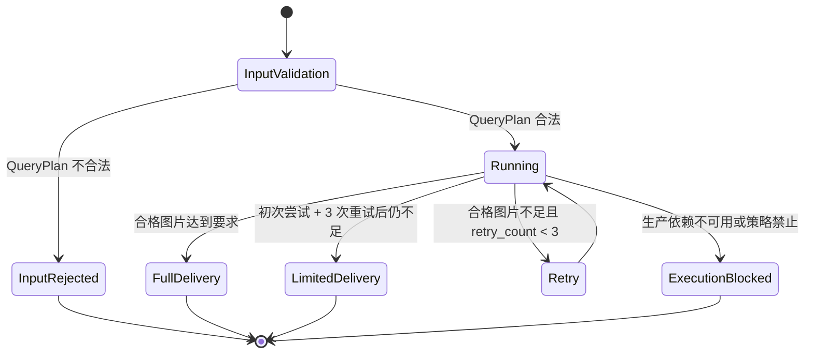

# 图片验收与任务编排状态机详细设计

## 修订记录

| 版本 | 日期 | 作者 | 修订内容 | 依据 |
| --- | --- | --- | --- | --- |
| v0.2 | 2026-06-19 | Codex | 按文档编写要求重写为简体中文正式文档，强化状态机、尝试计数、验收结论和参考文献。 | 用户文档编写要求；`tasks/design/design-planning.json` TASK-006 |
| v0.1 | 2026-06-19 | Codex | 完成图片机械验收、OpenClaw 图片评价、编排状态机和有限交付设计。 | PRD v0.17；HLD v0.11 |

## 文档目的

本文定义 TASK-006 的详细设计结论，说明图片机械验收、OpenClaw 图片评价归一、Task Orchestrator state machine、attempt counting and delivery decision design、完整交付、执行阻塞、重试和有限交付。本文不定义交付包文件布局。

固定交付位置为 `docs/design/TASK-006-image-acceptance-orchestrator-design.md`。规划输出覆盖：image mechanical acceptance design；OpenClaw image evaluation normalization design；Task Orchestrator state machine design；attempt counting and delivery decision design。

## 来源与追溯

| 来源标记 | 设计依据 |
| --- | --- |
| `docs/PRD.md:121-159` | 交付状态、用户流程和重试/有限交付规则。 |
| `docs/PRD.md:208-211` | AC-008 至 AC-011 图片验收、有限交付和 OpenClaw 生产路径验收。 |
| `docs/HLD.md:260-372` | 运行时视图、状态视图和执行阻塞路径。 |
| `AGENTS.md:85-109` | 仓库宪法中的图片验收、OpenClaw、重试和有限交付规则。 |

## 范围边界

| 类别 | 内容 |
| --- | --- |
| 范围内 | 图片机械验收、OpenClaw 图片主观验收、图片决策归一、任务状态机、`retry_count`、`full_attempt_count`、完整交付、有限交付、执行阻塞。 |
| 范围外 | 候选搜索协议、抓取 channel 实现、交付包目录布局、最终文件格式。 |
| 禁止事项 | 不得改变初次尝试加 3 次重试规则；不得把 mock/fixture 作为生产验收；不得把候选元信息当作真实图片验收。 |

## 状态机

## 控制流

1. 编排器接收 `TaskPlan`，初始化 `full_attempt_count = 1`、`retry_count = 0`。
2. 每个完整尝试从搜索、候选质量、抓取批次开始，直到图片验收或执行阻塞。
3. 抓取产生真实图片后，先进行图片机械验收。
4. 机械阻塞图片不计入合格图片。
5. 机械未阻塞图片携带参考信息进入 OpenClaw 图片评价。
6. OpenClaw 图片评价不可执行时，任务进入执行阻塞。
7. OpenClaw 明确通过且机械验收通过时，图片计入合格。
8. OpenClaw 拒绝或不确定时，图片不计入合格。
9. 合格图片达到 QueryPlan 要求时，立即完整交付并终止当前 QueryPlan。
10. 本次尝试结束仍不足且可重试时，`retry_count` 加 1，`full_attempt_count` 加 1，并重复完整流程。
11. 初次尝试加 3 次重试后仍不足时，按实际合格图片数量有限交付，实际合格图片可以为 0。

## 数据流

输入包括 TASK-002 的 required count、质量偏好和重试边界，TASK-004 的候选评价语义，TASK-005 的真实图片 artifact、抓取失败、局部拒绝和短批次证据。

输出包括合格图片列表、拒绝图片证据、图片验收决策、任务状态转换、执行阻塞原因、完整/有限/阻塞交付决策、合格图片达成率和任务结果分布事件。

## 接口与类型

| 类型族 | 说明 |
| --- | --- |
| `TaskState` | input validation、running、retry、full delivery、limited delivery、execution blocked。 |
| `AttemptCounter` | 区分 `full_attempt_count` 与 `retry_count`。 |
| `ImageArtifact` | TASK-005 产出的真实抓取图片引用。 |
| `ImageMechanicalEvidence` | 图片机械验收阻塞与参考证据。 |
| `ImageEvaluationRequest` | 真实图片、QueryPlan、机械参考信息、来源和风险。 |
| `ImageEvaluationConclusion` | 通过、拒绝、不确定、不可执行。 |
| `ImageAcceptanceDecision` | 合格、机械阻塞、主观拒绝、不确定不通过、执行阻塞。 |
| `DeliveryDecision` | 完整交付、有限交付、执行阻塞。 |

## 状态与持久化

任务上下文保存 QueryPlan、TaskPlan、尝试计数、候选证据、抓取证据、图片验收、合格图片、阻塞原因和终态。持久化交由 TASK-007 的交付包边界处理。

计数语义：

| 计数项 | 含义 |
| --- | --- |
| `full_attempt_count` | 初次尝试和每次完整重试的总次数。 |
| `retry_count` | 初次尝试之后的重复次数，最大为 3。 |

## 错误与诊断

诊断类别包括无真实图片、图片损坏、重复、语义不匹配、低于质量档位、授权风险、OpenClaw 图片评价不可用、OpenClaw 拒绝和 OpenClaw 不确定。

OpenClaw 不可用是执行阻塞；OpenClaw 不确定不是执行阻塞，但不得计入合格图片。诊断必须说明当前合格数量、要求数量、尝试次数、重试次数、缺口和主要失败原因。

## 安全与权限

图片验收必须保留来源和授权风险。未知授权不能被描述为无风险或可商用。OpenClaw 图片评价请求不得包含本地凭据。fixture/mock 只能作为内部验证手段，不得成为生产验收依据。

## 可观测性

| 事件 | 指标用途 |
| --- | --- |
| 任务终态 | MET-001 任务结果分布。 |
| 合格图片数量/要求数量 | MET-003 合格图片达成率。 |
| 图片拒绝原因 | MET-004 主要拒绝原因。 |
| OpenClaw 图片结论 | MET-006 评价通过率。 |
| 尝试计数与缺口 | 解释有限交付。 |

## 验证与验收

验收应确认：机械通过且 OpenClaw 明确通过才算合格；机械失败、主观拒绝和不确定均不计入合格；OpenClaw 不可执行形成执行阻塞；达标立即完整交付；不足时重复完整流程；初次尝试加 3 次重试后有限交付；`retry_count` 与 `full_attempt_count` 不混淆。

## 风险与移交

开放风险包括 OpenClaw 图片评价责任边界、质量校准和授权阻塞细则。移交关系如下：

| 下游任务 | 移交内容 |
| --- | --- |
| TASK-007 | 合格图片、拒绝图片、终态、执行阻塞、缺口和指标事件。 |
| TASK-008 | image OpenClaw readiness 与技能可执行性。 |
| TASK-009 | 状态机一致性和交付决策验收。 |

## 参考文献

| 标记 | 来源 |
| --- | --- |
| [PRD-01] | `docs/PRD.md` v0.17 |
| [HLD-01] | `docs/HLD.md` v0.11 |
| [AGENT-01] | `AGENTS.md` |
| [PLAN-01] | `tasks/design/design-planning.json` TASK-006 |
