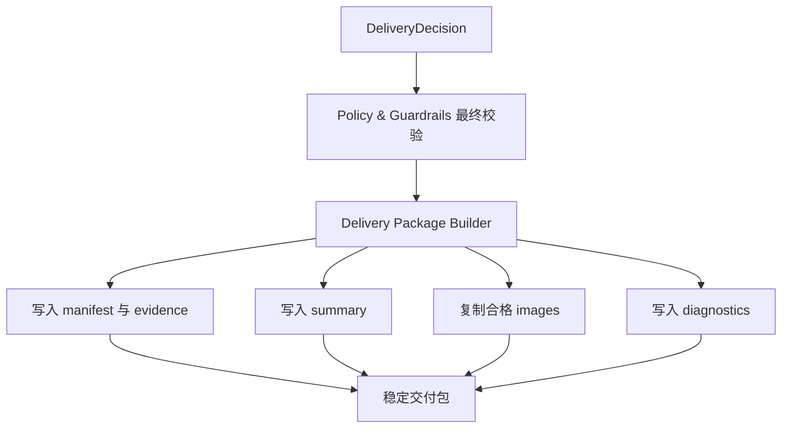

# 交付包、策略与可观测性详细设计

## 修订记录

| 版本 | 日期 | 作者 | 修订内容 | 依据 |
| --- | --- | --- | --- | --- |
| v0.3 | 2026-06-20 | Codex | 补齐交付包机器可读契约，固定 `status.json`、`manifest.json` 与关键字段边界，消除格式占位并强化自动化消费验收。 | PRD v0.17；HLD v0.11；LLD 深度审阅结论 |
| v0.2 | 2026-06-19 | Codex | 按文档编写要求重写为简体中文正式文档，强化交付包结构、机器可读状态、策略边界和指标来源。 | 用户文档编写要求；`tasks/design/design-planning.json` TASK-007 |
| v0.1 | 2026-06-19 | Codex | 完成交付包、策略、安全、指标、验证和回滚证据设计。 | PRD v0.17；HLD v0.11 |

## 文档目的

本文定义 TASK-007 的详细设计结论，说明交付包目录/文件布局、机器可读状态与 manifest、策略与守护边界、诊断、指标事件来源、fixture 验证、真实服务验证和回滚证据。本文不选择具体序列化库。

固定交付位置为 `docs/design/TASK-007-delivery-policy-observability-design.md`。规划输出覆盖：delivery package directory and file layout design；machine-readable delivery status and manifest contract design；policy and guardrail decision design；diagnostics and observability event source design；fixture and real-service verification plan design。

## 来源与追溯

| 来源标记 | 设计依据 |
| --- | --- |
| `docs/PRD.md:121-131` | 交付物状态、完整交付、有限交付、执行阻塞和输入拒绝。 |
| `docs/PRD.md:178-222` | 非功能需求、指标、验收、发布、真实服务验证与回滚。 |
| `docs/HLD.md:402-431` | 安全、隐私、合规、可靠性、可观测性和发布设计。 |
| `docs/HLD.md:473-476` | 需求追踪矩阵中的安全、指标和验证来源。 |

## 范围边界

| 类别 | 内容 |
| --- | --- |
| 范围内 | 交付包目录、机器可读状态、manifest、人工摘要、策略决策、敏感信息排除、MET-001 至 MET-006 事件来源、验证和回滚证据。 |
| 范围外 | 具体序列化库、最终 Rust 文件路径、图片抓取实现、OpenClaw 协议、授权风险分组体验。 |
| 禁止事项 | 不得把未知授权写成商用安全；不得把输入拒绝包装成交付包；不得把未验收图片放入 `images/`。 |

## 交付包结构

```text
<delivery-package>/
  status.json
  manifest.json
  summary.md
  images/
  evidence/
  diagnostics/
```

| 区域 | 设计结论 |
| --- | --- |
| `status.json` | 稳定表达 `full_delivery`、`limited_delivery` 或 `execution_blocked`，供自动化流程以最小成本判断任务终态。 |
| `manifest.json` | 记录合格图片、来源、数量、风险、缺口、拒绝摘要、指标摘要和证据引用。 |
| `summary.md` | 面向人类读者解释任务结果。 |
| `images/` | 只包含 TASK-006 判定为合格的图片。 |
| `evidence/` | 记录候选、抓取、图片验收、fallback 和 OpenClaw 结论的脱敏证据。 |
| `diagnostics/` | 记录非敏感诊断和指标摘要。 |

`status.json` 与 `manifest.json` 使用 UTF-8 JSON 文档作为 MVP 的机器可读格式。本文只定义落盘契约，不指定 Rust 序列化库、字段顺序或内部实现类型。

## 机器可读状态契约

`status.json` 是自动化调用方的首要入口，必须保持短小、稳定、可判读。

| 字段 | 必填 | 取值或含义 |
| --- | --- | --- |
| `schema_version` | 是 | 交付状态契约版本，MVP 为 `1`。 |
| `task_status` | 是 | `full_delivery`、`limited_delivery`、`execution_blocked` 三者之一。 |
| `required_count` | 是 | QueryPlan 要求的交付图片数量。 |
| `accepted_count` | 是 | 实际合格图片数量。 |
| `gap_count` | 是 | `required_count - accepted_count`，完整交付时为 `0`。 |
| `attempts_used` | 是 | 已执行的完整尝试次数。 |
| `retry_count` | 是 | 初次尝试之后已经发生的重试次数。 |
| `primary_reason` | 是 | 终态的主要原因摘要，必须脱敏。 |
| `manifest_path` | 是 | 指向同一交付包内 `manifest.json` 的相对路径。 |
| `summary_path` | 是 | 指向同一交付包内 `summary.md` 的相对路径。 |

`status.json` 不得包含图片二进制、外部服务原始响应、密钥、token、cookie 或本地敏感配置。输入拒绝不是交付结果，因此不生成 `status.json`。

## Manifest 契约

`manifest.json` 是交付包的完整机器可读说明，必须支持人工摘要、自动化消费和 QA 抽查共用同一事实来源。

| 字段 | 必填 | 设计结论 |
| --- | --- | --- |
| `schema_version` | 是 | Manifest 契约版本，MVP 为 `1`。 |
| `query_plan_summary` | 是 | 脱敏后的语义描述、数量、质量档位、约束、授权偏好和输出偏好摘要。 |
| `delivery_status` | 是 | 与 `status.json.task_status` 一致。 |
| `accepted_images` | 是 | 合格图片清单；有限交付 0 张时为空数组。 |
| `gap` | 是 | 要求数量、合格数量、差额和主要缺口原因。 |
| `candidate_summary` | 是 | 候选目标、实际候选、去重后候选、候选短缺和主要候选拒绝类别。 |
| `retrieval_summary` | 是 | 批次目标、实际批次、channel 尝试、fallback、局部拒绝和无真实图片批次事实。 |
| `acceptance_summary` | 是 | 图片机械验收、OpenClaw 图片验收、拒绝类别和不确定结论摘要。 |
| `risk_summary` | 是 | 授权未知、明确禁止来源、访问限制、付费边界和策略阻塞说明。 |
| `metrics` | 是 | MET-001 至 MET-006 的本任务事件输入或摘要。 |
| `evidence_refs` | 是 | 指向 `evidence/` 与 `diagnostics/` 中脱敏证据文件的相对路径。 |

`accepted_images` 的每一项必须至少包含包内图片相对路径、来源说明、接受原因、质量说明、授权风险标签、机械验收证据引用和 OpenClaw 验收证据引用。未通过验收、下载失败或仅作为候选存在的图片不得出现在 `accepted_images` 或 `images/` 中。

## 控制流



交付包只在正式任务终态生成。输入拒绝是前置结果，不进入交付包结构。

## 数据流

输入来自 TASK-002 至 TASK-006：输出偏好、provider 使用事件、候选质量事件、抓取 channel 事件、fallback 事件、合格图片、拒绝图片、执行阻塞、尝试计数和终态。输出是交付包、状态、manifest、摘要、证据、诊断和指标事件映射。

交付包生成不得触发新的搜索、抓取或主观评价。

## 接口与类型

| 类型族 | 说明 |
| --- | --- |
| `DeliveryStatus` | 完整交付、有限交付、执行阻塞。 |
| `DeliveryManifest` | 图片清单、来源、数量、风险、证据引用和缺口。 |
| `DeliveryImageEntry` | 合格图片、来源、接受原因、质量说明、风险标签。 |
| `DeliveryGap` | 要求数量、合格数量、差额和主要原因。 |
| `PolicyDecision` | 允许、局部拒绝、任务阻塞、风险提示、需用户决策。 |
| `MetricEvent` | 指标来源、类别、计数或比率输入。 |
| `RedactionRule` | 敏感信息排除规则。 |

## 状态与持久化

交付包是 MVP 的持久化边界。构建时应先形成完整内部结果，再暴露稳定状态，避免部分文件被误读为完整交付。回滚时必须保留执行阻塞和风险证据。

## 策略、安全与权限

策略边界统一处理：

- 凭据不得进入交付包、日志或指标。
- fallback 不得绕过登录、付费墙、访问控制或站点授权。
- 未知授权保留风险提示。
- 明确禁止来源必须拒绝或阻塞。
- 付费服务默认禁用，需显式配置或确认。
- mock/fixture 不得作为生产主观评价证据。

## 错误与诊断

诊断应包含终态、合格数量、要求数量、尝试次数、候选目标、候选实际数量、批次目标、实际批次、主要拒绝类别、fallback 使用、策略阻塞、OpenClaw 结论和下一步调整建议。

## 可观测性

| 指标 | 事件来源 |
| --- | --- |
| MET-001 任务结果分布 | TASK-002 输入拒绝边界、TASK-006 终态。 |
| MET-002 候选满足率 | TASK-003 候选目标与去重后候选数量。 |
| MET-003 合格图片达成率 | TASK-006 合格图片数量与要求数量。 |
| MET-004 主要拒绝原因 | TASK-004 候选拒绝、TASK-006 图片拒绝。 |
| MET-005 抓取渠道有效性 | TASK-005 channel 尝试、fallback、成功与贡献。 |
| MET-006 OpenClaw 评价通过率 | TASK-004 候选评价、TASK-006 图片评价。 |

## 验证与验收

fixture 验证用于内部闭环，不能作为生产交付依据。真实服务验证必须覆盖真实搜索服务、OpenClaw 生产评价、普通 web fetch、所有已启用 channel fallback、未启用 channel 禁用说明和敏感信息排除。

验收应确认：完整交付包含足量合格图片；有限交付可为 0 张且解释缺口；执行阻塞说明阻塞原因；自动化可稳定读取状态；未知授权不被美化；MET-001 至 MET-006 均有事件来源。

## 风险与移交

开放风险包括具体 Rust 序列化库、授权风险分组、robots/site-rule 策略、最大 QueryPlan 数量和付费 channel 启用边界。`status.json` 与 `manifest.json` 的机器可读格式已经在本文固定，不再作为开放风险。移交关系如下：

| 下游任务 | 移交内容 |
| --- | --- |
| TASK-008 | 策略阻塞、诊断模型和 readiness 相关风险。 |
| TASK-009 | 交付、策略、指标与跨文档一致性验收。 |

## 参考文献

| 标记 | 来源 |
| --- | --- |
| [PRD-01] | `docs/PRD.md` v0.17 |
| [HLD-01] | `docs/HLD.md` v0.11 |
| [PLAN-01] | `tasks/design/design-planning.json` TASK-007 |
