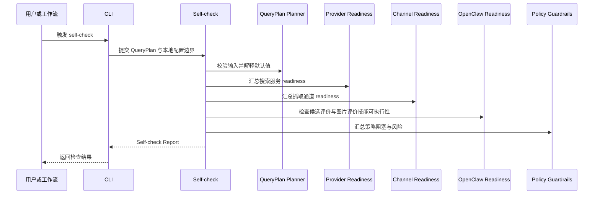

# 运行前自助检查详细设计

## 修订记录

| 版本 | 日期 | 作者 | 修订内容 | 依据 |
| --- | --- | --- | --- | --- |
| v0.2 | 2026-06-19 | Codex | 按文档编写要求重写为简体中文正式文档，强化 readiness 聚合、非交付边界和参考文献。 | 用户文档编写要求；`tasks/design/design-planning.json` TASK-008 |
| v0.1 | 2026-06-19 | Codex | 完成 self-check report、readiness 聚合和非交付边界设计。 | PRD v0.17；HLD v0.11 |

## 文档目的

本文定义 TASK-008 的详细设计结论，说明正式任务运行前的自助检查入口、readiness 聚合、Self-check Report、诊断、自动化可读状态和非交付边界。本文不执行搜索、抓取、生产主观评价或交付打包。

固定交付位置为 `docs/design/TASK-008-readiness-self-check-design.md`。规划输出覆盖：Self-check Report detailed design；readiness aggregation control flow design；provider/channel/candidate OpenClaw/image OpenClaw/policy readiness input design；self-check diagnostics and non-delivery boundary design。

## 来源与追溯

| 来源标记 | 设计依据 |
| --- | --- |
| `docs/PRD.md:175` | FR-012 自助检查能力。 |
| `docs/PRD.md:212` | AC-012 正式运行前暴露阻塞问题。 |
| `docs/HLD.md:78` | HLD 中运行前自助检查范围。 |
| `docs/HLD.md:205` | Self-check / Readiness Reporter 职责。 |
| `docs/HLD.md:219-233` | 候选评价与图片评价两条 OpenClaw 边界。 |
| `docs/HLD.md:235-257` | 自助检查时序。 |
| `docs/HLD.md:420` | 运行前检查可靠性目标。 |

## 范围边界

| 类别 | 内容 |
| --- | --- |
| 范围内 | QueryPlan 合法性、provider readiness、channel readiness、candidate OpenClaw readiness、image OpenClaw readiness、policy readiness、诊断和报告。 |
| 范围外 | 搜索候选、下载图片、生产主观评价、交付包生成、图片验收。 |
| 禁止事项 | 不得把 self-check 结果当作交付结果；不得生成合格图片；不得通过自检绕过策略或权限。 |

## 控制流

## 数据流

输入来自 TASK-002 的 QueryPlan 校验与默认值、TASK-003 的 provider readiness、TASK-005 的 channel readiness、TASK-004 的 candidate OpenClaw 可用性、TASK-006 的 image OpenClaw 可用性、TASK-007 的策略与诊断模型。

输出是 `SelfCheckReport`，包含状态、阻塞项、警告项、默认值解释、调整建议和脱敏诊断。报告不是交付包，不包含 `images/`、accepted image list 或 delivery manifest。

## 接口与类型

| 类型族 | 说明 |
| --- | --- |
| `SelfCheckRequest` | QueryPlan 输入和本地配置边界。 |
| `ReadinessInputStatus` | valid、warning、blocked。 |
| `ProviderReadinessSummary` | provider 启用、配置和凭据状态。 |
| `RetrievalChannelReadinessSummary` | channel 启用、依赖、付费确认和限制状态。 |
| `OpenClawReadinessSummary` | candidate OpenClaw 与 image OpenClaw 分别检查。 |
| `PolicyReadinessSummary` | 授权、访问、付费、敏感信息和开放决策风险。 |
| `SelfCheckStatus` | pass、warning、blocked。 |
| `SelfCheckReport` | 面向人类和自动化的检查结果。 |

## 状态与持久化

self-check 状态独立于正式任务状态。`self_check_pass`、`self_check_warning`、`self_check_blocked` 不等同于 `full_delivery`、`limited_delivery` 或 `execution_blocked`。MVP 可选择输出临时诊断报告，但该报告不得位于正式交付包语义下。

## 错误与诊断

诊断类别包括 QueryPlan 非法、默认值应用、大数量风险、无 enabled provider、provider 缺凭据、无 enabled channel、付费 channel 未确认、candidate OpenClaw 不可用、image OpenClaw 不可用、策略阻塞和敏感配置不可回显。

诊断应区分 blocker 与 warning。blocker 表示正式任务很可能输入拒绝或执行阻塞；warning 表示任务可运行但存在风险或开放决策。

## 安全与权限

self-check 可以说明凭据缺失、存在或配置异常，但不得展示凭据值。自检不得通过访问受限来源来证明可抓取性，也不得执行真实搜索或真实抓取。未知授权仍是风险，不得被描述为安全可商用。

## 可观测性

自检可记录 pass/warning/blocked 分布、阻塞类别、provider readiness 分布、channel readiness 分布、OpenClaw 两类评价 readiness 和策略 blocker。该类事件是运维诊断，不替代正式任务的 MET-001。

## 验证与验收

验收应确认：非法 QueryPlan 产生 blocked；provider 缺凭据可见；无 enabled channel 可见；付费 channel 禁用可见；candidate OpenClaw 与 image OpenClaw 可分别报告；策略 blocker 脱敏展示；self-check 不搜索、不抓取、不生产主观评价、不生成交付包。

## 风险与移交

开放风险包括 self-check CLI 语法、报告格式、provider/channel 具体 readiness 探针和 OpenClaw 生产用法。移交关系如下：

| 下游任务 | 移交内容 |
| --- | --- |
| TASK-009 | readiness 覆盖、非交付边界和跨文档一致性验收。 |
| 后续开发规划 | self-check 命令、报告输出和脱敏实现任务。 |

## 参考文献

| 标记 | 来源 |
| --- | --- |
| [PRD-01] | `docs/PRD.md` v0.17 |
| [HLD-01] | `docs/HLD.md` v0.11 |
| [PLAN-01] | `tasks/design/design-planning.json` TASK-008 |
