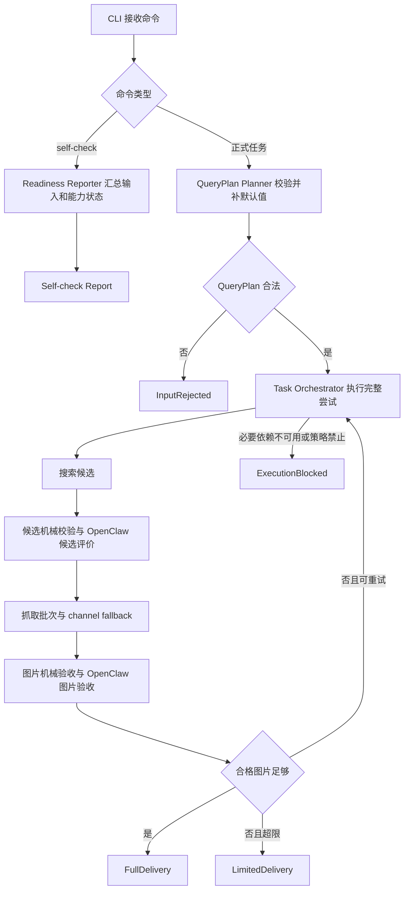

# image-retrieval Rust 实现详细设计基线

## 修订记录

| 版本 | 日期 | 作者 | 修订内容 | 依据 |
| --- | --- | --- | --- | --- |
| v0.3 | 2026-06-20 | Codex | 补齐 Rust CLI MVP 的异步与并发模型、超时取消、共享状态和测试确定性边界。 | PRD v0.17；HLD v0.11；LLD 深度审阅结论 |
| v0.2 | 2026-06-19 | Codex | 按详细设计文档编写要求重写为简体中文正式文档，补充修订记录、参考文献和结构化设计结论。 | 用户文档编写要求；`tasks/design/design-planning.json` TASK-001 |
| v0.1 | 2026-06-19 | Codex | 建立 Rust CLI MVP 的跨任务详细设计基线。 | PRD v0.17；HLD v0.11 |

## 文档目的

本文是 `image-retrieval` 的 Rust 实现详细设计基线，面向后续详细设计、开发规划和工程实现读者。本文只定义 Rust CLI MVP 的模块职责、领域类型族、端口边界、状态边界、错误诊断、安全、可观测性和移交关系，不创建代码、测试、`Cargo.toml`、运行脚本或生产配置。

本文固定交付位置为 `docs/design/rust-implementation-design.md`。规划输出覆盖：overall Rust crate and module boundary design；domain type and state boundary design；cross-task handoff map for docs/design。

## 来源与追溯

| 来源标记 | 内容 |
| --- | --- |
| `docs/PRD.md:24-32` | PRD 文档目的、适用范围和产品边界。 |
| `docs/HLD.md:17-33` | HLD 系统边界、当前状态与架构设计范围。 |
| `docs/HLD.md:162-217` | HLD 模块职责、`BaseProvider`、`BaseRetrievalChannel`、质量门禁、交付与指标边界。 |
| `AGENTS.md:111-130` | 仓库宪法中的 Rust CLI、工程规则与验证约束。 |

## 范围边界

| 类别 | 结论 |
| --- | --- |
| 范围内 | Rust CLI 的 planned crate/module boundary、领域对象、端口契约、状态模型、错误族、诊断、安全、可观测性、验证策略和跨文档移交。 |
| 范围外 | Web UI、SaaS、多用户服务端、任务队列、图片编辑、生成式补图、数据库持久化和外部服务协议细节。 |
| 禁止事项 | 不得实现代码，不得创建 Cargo manifest，不得选择 PRD/HLD 未确定的第三方库，不得把开放产品决策写成既定事实。 |

## 模块边界设计

系统采用本地单进程 Rust CLI 形态。由于仓库当前没有 Cargo 工程骨架，本文只给出实施时的模块归属，不规定实际文件名。

| 模块 | 职责 | 不负责 |
| --- | --- | --- |
| CLI Adapter | 接收命令意图，触发 self-check 或正式任务，返回任务状态与结果位置。 | 搜索、抓取、评价和交付业务规则。 |
| Domain | 维护 QueryPlan、TaskPlan、候选、抓取、图片验收、交付、策略、证据和指标的领域模型。 | 外部协议适配。 |
| Orchestrator | 串联搜索、候选门禁、抓取、图片验收、重试、完整交付、有限交付和执行阻塞。 | 具体 provider/channel 实现。 |
| Ports | 定义 `BaseProvider`、`BaseRetrievalChannel` 和 OpenClaw Evaluation Port。 | 具体外部服务协议。 |
| Quality | 维护候选机械校验、图片机械验收和主观评价归一。 | 交付包写入。 |
| Delivery | 生成用户可读、自动化可判读的交付包。 | 输入拒绝包装成可消费交付。 |

## 控制流

正式任务以 `TaskPlan` 为执行边界。候选阶段只决定可抓取优先序列；图片阶段才决定合格交付。OpenClaw 生产评价不可执行时，合法任务进入执行阻塞。合格图片达到要求时立即完整交付；初次尝试加 3 次重试后仍不足时有限交付。

## 数据流

数据转换必须保持外部 DTO 与内部领域对象分离。外部 provider/channel/OpenClaw 的原始响应不得直接污染核心领域；核心层只消费归一后的候选、抓取结果、评价结论、策略事实和证据事件。

## 接口与类型契约

核心类型族如下：

| 类型族 | 用途 |
| --- | --- |
| `QueryPlanInput` / `ValidatedQueryPlan` / `TaskPlan` | 输入、默认值、派生候选目标、批次目标和重试边界。 |
| `ProviderId` / `BaseProvider` / `CandidateRecord` | 搜索服务接入、候选归一、来源追踪和候选不足证据。 |
| `CandidateDecision` | 候选机械校验、OpenClaw 候选评价和可抓取序列归一。 |
| `BaseRetrievalChannel` / `RetrievalResult` | 抓取通道能力、等级、限制、失败事实和真实图片产出。 |
| `ImageAcceptanceDecision` | 图片机械验收、OpenClaw 图片验收和合格图片判断。 |
| `PolicyDecision` | 授权、访问限制、付费边界、敏感凭据和策略阻塞。 |
| `DeliveryManifest` / `MetricEvent` | 交付包、自动化状态、指标和诊断证据。 |

`BaseProvider` 是 HLD canonical 术语，与宪法中的 `BaseSearchProvider` 表达同一搜索服务基础契约。

## 状态与持久化

MVP 状态模型以单任务内存上下文为主，持久化边界是最终交付包。任务上下文保存 QueryPlan、TaskPlan、候选、候选决策、抓取批次、抓取结果、图片验收、合格图片、策略决策、指标事件和最终状态。

持久化原则：

- 输入拒绝不生成可消费交付包。
- 交付包不得包含密钥、token 或敏感配置。
- 部分下载或临时产物不得伪装成合格图片。
- 若后续引入数据库或缓存，必须另行设计状态一致性和迁移策略。

## 异步与并发

MVP 是本地单进程 CLI，但搜索、抓取和 OpenClaw 评价都属于外部 I/O 边界。详细设计将这些边界表达为可异步执行的端口能力，同时不在本文固定具体 async runtime、HTTP 客户端或并发库。

| 主题 | 设计结论 |
| --- | --- |
| 编排顺序 | Task Orchestrator 保持尝试级顺序：一次完整尝试必须按搜索、候选门禁、抓取批次、图片验收、交付决策推进。 |
| 并发范围 | provider 搜索补充、批次内抓取和 OpenClaw 请求可以在实现阶段采用有限并发；并发不得改变候选决策、批次归属、尝试计数或最终状态语义。 |
| 有界并发 | 任一外部能力端口都必须具备并发上限设计，避免大 QueryPlan 或外部服务慢响应导致本地资源失控。具体上限属于后续配置/实现决策。 |
| 超时与取消 | provider、channel 和 OpenClaw 调用必须能归一为超时、取消、不可用或不可执行等诊断事实；OpenClaw 生产评价不可执行时仍按执行阻塞处理。 |
| 共享状态 | 任务上下文是唯一事实来源；并发任务只能提交归一事件或结果，由编排器按确定性规则合并。 |
| 顺序稳定性 | 候选排序、批次选择、合格图片累积和交付 manifest 输出必须具备稳定顺序，不能依赖外部请求完成先后。 |
| 测试确定性 | 随机调度、超时、外部失败和并发完成顺序应通过可控输入或替身端口验证；fixture/mock 只能用于内部验证，不能作为生产主观评价依据。 |

## 错误、失败与诊断

错误族包括输入拒绝、provider 失败、候选拒绝、抓取失败、图片拒绝、策略阻塞、OpenClaw 不可执行、完整交付、有限交付和执行阻塞。诊断应面向用户解释“为什么发生”，而不是暴露内部堆栈或服务私密信息。

诊断最小集合包括：任务状态、尝试次数、候选目标与实际数量、批次目标与实际数量、候选短缺、主要拒绝类别、fallback 使用情况、阻塞依赖、合格图片缺口和最终交付状态。

## 安全、权限与合规

设计遵循 PRD 守护指标：不得绕过登录、付费墙、访问控制或站点授权限制；未知授权不得被描述为可商用或无风险；凭据属于本地运行配置，不能进入交付包、用户可见日志或指标。

fallback 不得用于规避限制。若低级渠道发现访问控制或授权限制，升级渠道必须先经过策略边界判断。

## 可观测性与指标

系统应产生结构化任务证据以支持 MET-001 至 MET-006：任务结果分布、候选满足率、合格图片达成率、主要拒绝原因、抓取渠道有效性和 OpenClaw 评价通过率。指标事件由任务上下文产生，TASK-007 负责最终交付包和指标摘要表达。

## 验证与验收

详细设计层面的验收关注设计完整性，不代表实现测试已经存在。后续实现应覆盖 QueryPlan 默认值、provider 调度、候选归一、批次规划、质量门禁、任务状态转换、策略决策和交付状态。真实服务验证必须使用真实搜索服务、OpenClaw 生产评价和普通 web fetch；fixture/mock 只能服务内部闭环验证。

## 风险与移交

开放风险包括 OpenClaw 生产使用方式、默认真实搜索 provider、内置 provider 清单、付费渠道启用、授权阻塞细则、robots/site-rule 策略、第四抓取渠道、最大 QueryPlan 数量和授权风险分组。

移交关系：

- TASK-002 继承 QueryPlan 与 CLI 输入规划边界。
- TASK-003 继承 `BaseProvider` 与搜索调度边界。
- TASK-004 继承候选质量门禁和 OpenClaw 候选评价边界。
- TASK-005 继承 `BaseRetrievalChannel`、批次和 fallback 边界。
- TASK-006 继承图片验收和任务状态机边界。
- TASK-007 继承交付包、策略、可观测性和验证边界。
- TASK-008 继承 readiness self-check 边界。
- TASK-009 负责最终详细设计验收。

## 参考文献

| 标记 | 来源 |
| --- | --- |
| [PRD-01] | `docs/PRD.md` v0.17 |
| [HLD-01] | `docs/HLD.md` v0.11 |
| [AGENT-01] | `AGENTS.md` |
| [PLAN-01] | `tasks/design/design-planning.json` TASK-001 |
