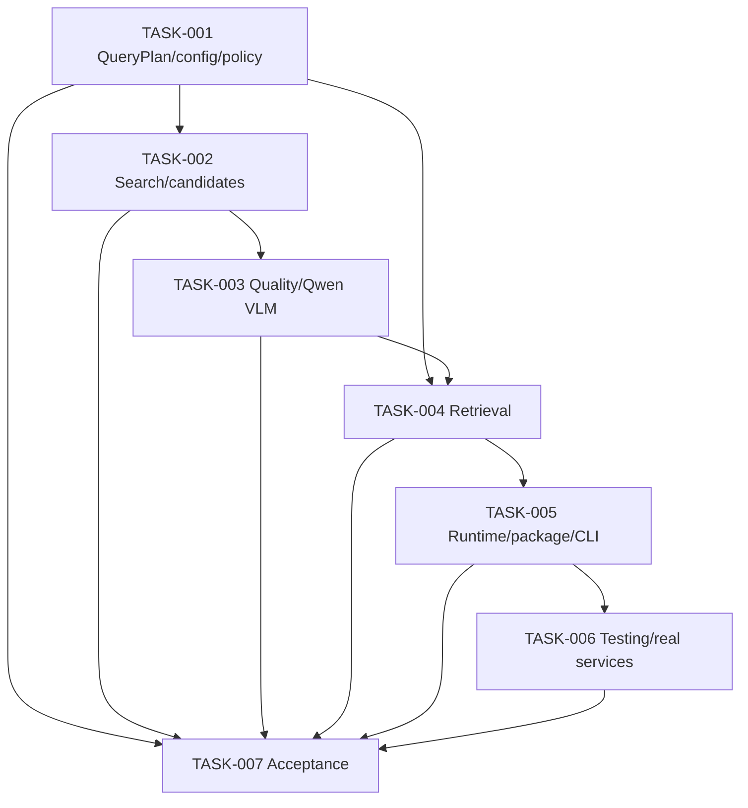

# image-retrieval v1.1 LLD Tasks

## Planning Source

This file is an index for the `design-planning` output that plans the v1.1
low-level design work. The authoritative task graph, fixtures, spec-executor
handoff, and quality gates are generated under:

- `tasks/design/v1.1-lld/design-planning.json`
- `tasks/design/v1.1-lld/fixtures/`
- `tasks/design/v1.1-lld/validate_design_doc_quality.py`

The `design-planning` skill plans future detailed design deliverables only. It
does not write the detailed design documents themselves.

## Planned LLD Deliverables

| ID | Design Concern | Planned Deliverable |
| --- | --- | --- |
| TASK-001 | QueryPlan, config, and policy | `docs/design/v1.1-TASK-001-queryplan-config-policy-design.md` |
| TASK-002 | Search provider and candidate pipeline | `docs/design/v1.1-TASK-002-search-provider-candidate-design.md` |
| TASK-003 | Candidate/image quality and Qwen 3.5 VLM boundary | `docs/design/v1.1-TASK-003-quality-vlm-design.md` |
| TASK-004 | Retrieval artifact channels and fallback | `docs/design/v1.1-TASK-004-retrieval-artifact-channel-design.md` |
| TASK-005 | Orchestrator, package, validation, and CLI | `docs/design/v1.1-TASK-005-orchestrator-package-validation-cli-design.md` |
| TASK-006 | Testing and real-service acceptance design | `docs/design/v1.1-TASK-006-testing-real-service-acceptance-design.md` |
| TASK-007 | Cross-design acceptance review | `docs/design/v1.1-TASK-007-detailed-design-acceptance-review.md` |

## Dependency Order

## Execution Rule

Before implementation planning is treated as final, execute the planned LLD
tasks and validate each produced `docs/design/*.md` file with the bundled
quality gate declared in the corresponding `spec.yaml`.
